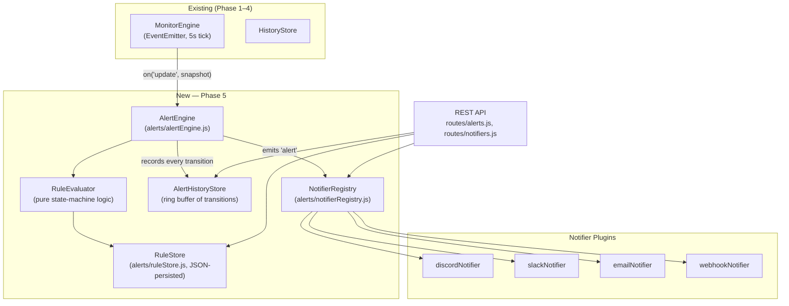
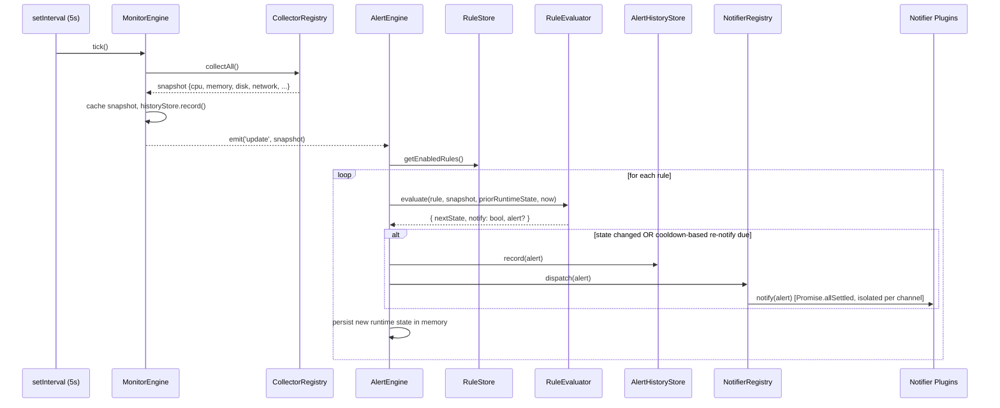
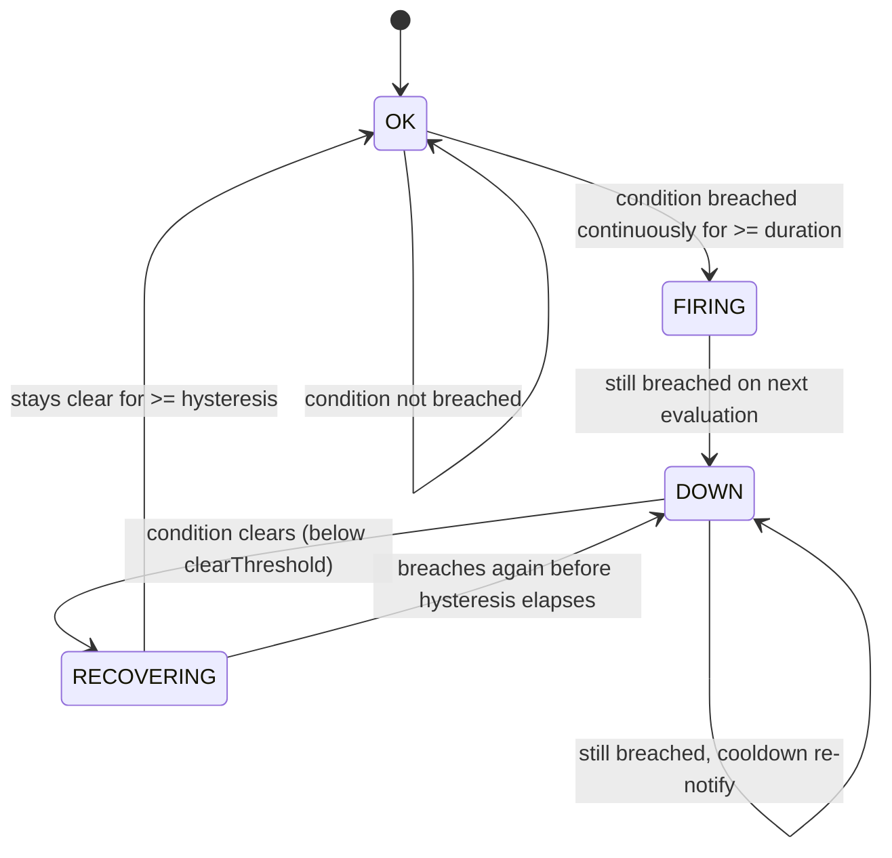

# Phase 5 Implementation Plan — Alerting & Notifications

**Status:** Design spec — no code written yet.
**Depends on:** Milestone 1 (public-release hardening) being merged, plus the following Milestone 2 prerequisites landing first:
- Routes extracted out of `server.js` into `routes/` (this plan assumes that structure exists)
- `dotenv` wired up for environment-based configuration

This document is the implementation contract for Phase 5. Anything not specified here (silencing/mute windows, alert grouping, PagerDuty-style escalation) is explicitly out of scope — see the stretch section at the end.

---

# Objectives

1. Turn passive metrics into actionable alerts: detect when a metric crosses a defined threshold and stays there, not on every noisy tick.
2. Notify humans through the channels they actually watch (Discord, Slack, Email, or any custom system via a generic webhook) — without spamming them every 5 seconds while an incident is ongoing.
3. Avoid flapping: a metric bouncing across a threshold should not fire ten notifications in two minutes.
4. Preserve the codebase's existing plugin philosophy: collectors are plugins registered into `collectorRegistry`; notifiers must be plugins registered into an equivalent `notifierRegistry`, so adding PagerDuty later means adding one file, not touching the engine.
5. Preserve the existing resilience lesson from the Phase 1–4 audit: one failing notifier (Discord webhook down) must never block or delay another (Slack still gets the message).

**Non-objectives (deferred):** multi-tenant alert ownership, escalation policies, on-call scheduling, alert grouping/correlation across rules, mute/maintenance windows (stretch, see end of doc).

---

# Architecture

Phase 5 adds two new top-level modules, mirroring the existing `collectors/` + `monitor/` pattern:

- **`alerts/`** — the evaluation core: rule storage, the state-machine evaluator, the engine that wires it to `monitorEngine`, and a history ring buffer for past alert transitions.
- **`notifiers/`** — plugins, one file per channel, each exporting `{ name, notify(alert) }`, exactly like `collectors/*.js` export `{ name, collect() }`.



**Why a separate `AlertEngine` instead of extending `MonitorEngine`:** `MonitorEngine`'s job is "poll and cache." Alert evaluation is a *subscriber* to that data, exactly like `historyStore.record()` already is (see `monitor/monitorEngine.js` — it emits `update`/`error` specifically so future subscribers don't require touching the engine). `AlertEngine` is just another `on('update', ...)` listener, added without modifying `monitorEngine.js`.

---

# Data Flow



Key property: alert evaluation happens **inside the same 5-second tick** as metric collection, so alert state is never more stale than the dashboard itself. No separate polling loop is introduced.

---

# State Machine

Per **rule**, not per metric — the same metric can have multiple rules (e.g. a "warning" and a "critical" disk-usage rule) with fully independent state.



### Transition table

| From | To | Guard | Notification sent |
|---|---|---|---|
| `OK` | `OK` | Metric does not breach `threshold` | none |
| `OK` | `OK` (internal `breachSince` timer running) | Metric breaches `threshold` but for < `duration` seconds | none — this is intentionally invisible externally, to avoid alerting on transient spikes |
| `OK` | `FIRING` | Metric has breached `threshold` continuously for >= `duration` seconds | **Yes** — "alert started" |
| `FIRING` | `DOWN` | Next evaluation tick, condition still breached | none (already notified on entering `FIRING`; `FIRING` is a one-tick edge state) |
| `DOWN` | `DOWN` | Still breached, and `now - lastNotifiedAt >= cooldown` | **Yes** — "still down" re-notification |
| `DOWN` | `DOWN` | Still breached, cooldown not yet elapsed | none (suppressed) |
| `DOWN` | `RECOVERING` | Metric drops below `clearThreshold` (defaults to `threshold` if unset) | none — recovery isn't confirmed yet |
| `RECOVERING` | `OK` | Stays below `clearThreshold` continuously for >= `hysteresis` seconds | **Yes** — "resolved" |
| `RECOVERING` | `DOWN` | Breaches `threshold` again before `hysteresis` elapses | none by default (see Duplicate Suppression) — treated as the *same* ongoing incident, not a new one |

**Why `FIRING` is a one-tick edge state and `DOWN` is the steady state:** it gives the API/dashboard a way to distinguish "this just started" from "this has been broken for an hour" without a second timestamp field, and it maps cleanly onto Alertmanager/Nagios-style hard/soft state conventions that operators already recognize.

**Why hysteresis uses a separate `clearThreshold` instead of just re-checking `threshold`:** without a gap between the alert threshold and the clear threshold, a metric sitting exactly at the boundary (e.g. disk usage oscillating between 84–86% against an `85%` threshold) flaps between `DOWN` and `RECOVERING` every tick. `clearThreshold` defaults to `threshold` (no band) for rules that don't configure one, but every rule *should* set a band in practice.

---

# Alert Engine

### Threshold Rules

A rule is a plain JSON object, validated on create/update:

```json
{
  "id": "disk-root-critical",
  "name": "Root disk usage critical",
  "metric": "disk.percent",
  "operator": ">=",
  "threshold": 90,
  "clearThreshold": 80,
  "duration": 30,
  "hysteresis": 60,
  "cooldown": 1800,
  "severity": "critical",
  "channels": ["discord", "email"],
  "enabled": true
}
```

| Field | Type | Meaning |
|---|---|---|
| `metric` | string | Dot-path into the `/api/system` snapshot (e.g. `cpu.usage`, `memory.percent`, `disk.percent`). Resolved with null-safety — a missing path never throws, it's treated as "no data" and skipped for that tick. |
| `operator` | `>` \| `>=` \| `<` \| `<=` \| `==` \| `!=` | Comparison applied to the resolved metric value vs `threshold`. |
| `duration` | seconds | How long the breach must persist before `OK → FIRING`. Debounces transient spikes (e.g. a momentary CPU blip). |
| `hysteresis` | seconds | How long the metric must stay clear before `RECOVERING → OK`. Debounces flapping on recovery. |
| `cooldown` | seconds | Minimum time between repeated notifications while `DOWN`. Prevents "still down" spam every 5 seconds. |
| `clearThreshold` | number, optional | Separate recovery boundary; defaults to `threshold`. |
| `channels` | string[], optional | Which registered notifiers to use for this rule; omitted/empty = all enabled notifiers. |

### Duration

Implemented as a `breachSince` timestamp stored in the rule's **runtime state** (kept in memory, separate from the rule *definition* in `RuleStore`). Set the first tick the condition is true; cleared the moment it's false. `OK → FIRING` fires when `now - breachSince >= duration * 1000`.

### Hysteresis

Symmetric mechanism on the way down: a `clearSince` timestamp set the first tick the metric is back under `clearThreshold`; cleared if it breaches again. `RECOVERING → OK` fires when `now - clearSince >= hysteresis * 1000`.

### Cooldown

Tracked via `lastNotifiedAt` on the runtime state. While in `DOWN`, a re-notification is only dispatched if `now - lastNotifiedAt >= cooldown * 1000`. The state itself doesn't change on a cooldown-driven re-notify — only the notification fires.

### Duplicate Suppression

- Every alert dispatched carries a stable `alertId = ruleId + ':' + incidentStartedAt` — the same ongoing incident (from `FIRING` through to the eventual `OK`) keeps one ID throughout, so notifiers/receivers can correlate "started," "still down," and "resolved" messages as one thread instead of unrelated pings.
- `RECOVERING → DOWN` (re-breach before hysteresis clears) does **not** mint a new `alertId` or send a "started" notification — it's the same incident continuing, not a new one. This is the main anti-flapping guarantee, on top of `duration`/`hysteresis` timers.
- The engine is the single writer of runtime state (no concurrent evaluation of the same rule), so no locking is needed — evaluation happens synchronously inside the `update` handler, one rule at a time.

---

# Notification Plugins

Interface contract (identical shape to `collectors/*.js`):

```js
module.exports = {
  name: "discord",
  configured() { /* returns bool — required env vars present */ },
  async notify(alert) { /* send it; throw on failure */ },
};
```

`notifierRegistry.register()` skips (with a one-line startup log) any notifier whose `configured()` returns `false` — mirrors how `networkCollector` degrades gracefully when `netstat` is unavailable rather than crashing the whole app.

The `alert` object passed to every `notify()`:

```json
{
  "alertId": "disk-root-critical:2026-08-07T10:00:00.000Z",
  "ruleId": "disk-root-critical",
  "ruleName": "Root disk usage critical",
  "metric": "disk.percent",
  "value": 91.4,
  "operator": ">=",
  "threshold": 90,
  "severity": "critical",
  "state": "FIRING",
  "previousState": "OK",
  "message": "Root disk usage critical is FIRING: disk.percent = 91.4 (threshold >= 90)",
  "timestamp": "2026-08-07T10:00:00.000Z"
}
```

### Discord (`notifiers/discordNotifier.js`)
- `DISCORD_WEBHOOK_URL` → HTTP POST via the global `fetch` (Node ≥18, no new dependency) with a Discord embed (color-coded by `severity`/`state`: red for `FIRING`/`DOWN`, green for `OK`).

### Slack (`notifiers/slackNotifier.js`)
- `SLACK_WEBHOOK_URL` → HTTP POST, simple `text` payload (Block Kit is a nice-to-have, not required for v1).

### Email (`notifiers/emailNotifier.js`)
- Requires a new dependency: **`nodemailer`** (Node has no built-in SMTP client).
- Reads `EMAIL_SMTP_*` vars, sends a plain-text message to `EMAIL_TO` from `EMAIL_FROM`.
- Recommend developing against [Ethereal](https://ethereal.email) (fake SMTP sandbox) or Mailtrap rather than a real inbox.

### Generic Webhook (`notifiers/webhookNotifier.js`)
- `WEBHOOK_URL` → HTTP POST of the raw `alert` JSON.
- If `WEBHOOK_SECRET` is set, sign the body with HMAC-SHA256 and send it as an `X-SND-Signature` header, so receivers can verify authenticity — this is the integration point for anything not natively supported (PagerDuty, Opsgenie, a custom script, etc.), so it should be trustworthy by design from day one.

**Isolation guarantee:** `notifierRegistry.dispatch(alert)` calls every enabled notifier's `notify()` via `Promise.allSettled`, each wrapped in its own try/catch with its own log line on failure. One channel's outage or misconfiguration never blocks or delays another — this directly applies the collector-isolation lesson from the Phase 1–4 review to the notification path.

---

# Configuration

New `.env` variables (documented in `.env.example`):

```bash
# --- Alert Engine ---
ALERTS_ENABLED=true
ALERTS_RULES_PATH=./data/alertRules.json   # JSON-persisted rule definitions

# --- Discord notifier ---
DISCORD_ENABLED=true
DISCORD_WEBHOOK_URL=

# --- Slack notifier ---
SLACK_ENABLED=true
SLACK_WEBHOOK_URL=

# --- Email notifier ---
EMAIL_ENABLED=false
EMAIL_SMTP_HOST=
EMAIL_SMTP_PORT=587
EMAIL_SMTP_SECURE=false
EMAIL_SMTP_USER=
EMAIL_SMTP_PASS=
EMAIL_FROM=alerts@sndhome.local
EMAIL_TO=

# --- Generic webhook notifier ---
WEBHOOK_ENABLED=false
WEBHOOK_URL=
WEBHOOK_SECRET=
```

Each notifier's `configured()` checks its own `*_ENABLED` flag AND that its required URL/credentials are non-empty — both must be true for it to register. Rules reference notifiers by `name` (`"discord"`, `"slack"`, `"email"`, `"webhook"`); an unconfigured channel referenced by a rule is simply skipped at dispatch time (logged once, not per-tick).

**Secrets handling:** webhook URLs and SMTP credentials are effectively passwords. `.env` is already gitignored; this plan adds no new secret-handling surface beyond what `dotenv` already implies, but notifier code must never log the raw URL/credentials — log the notifier `name` and outcome only.

---

# API

All new endpoints are namespaced under `/api/alerts` and `/api/notifiers`, following the existing `/api/system/*`, `/api/monitor/*` convention.

| Method | Endpoint | Description |
|---|---|---|
| `GET` | `/api/alerts/rules` | List all alert rules with their current runtime state (`OK`/`FIRING`/`DOWN`/`RECOVERING`) |
| `GET` | `/api/alerts/rules/:id` | Get a single rule + its runtime state |
| `POST` | `/api/alerts/rules` | Create a new rule (body validated against the schema above) |
| `PUT` | `/api/alerts/rules/:id` | Update an existing rule |
| `DELETE` | `/api/alerts/rules/:id` | Delete a rule (its runtime state is discarded too) |
| `GET` | `/api/alerts/active` | List only rules currently in `FIRING`, `DOWN`, or `RECOVERING` — the "what's broken right now" view |
| `GET` | `/api/alerts/history?limit=N` | Recent alert state-transition events (default 100), mirrors `/api/system/history`'s shape/pagination |
| `POST` | `/api/alerts/rules/:id/test` | Fire a synthetic alert for this rule through its configured channels, without needing a real breach — for verifying notification setup |
| `GET` | `/api/alerts/engine/status` | `{ running, rulesCount, activeAlertsCount, lastEvaluatedAt }` — mirrors `/api/monitor/status` |
| `GET` | `/api/notifiers` | List registered notifiers and whether each is configured/enabled (never returns secret values) |
| `POST` | `/api/notifiers/:name/test` | Send a test message through one specific channel |

<details>
<summary><code>GET /api/alerts/rules</code> — example response</summary>

```json
{
  "status": "ok",
  "data": [
    {
      "id": "disk-root-critical",
      "name": "Root disk usage critical",
      "metric": "disk.percent",
      "operator": ">=",
      "threshold": 90,
      "clearThreshold": 80,
      "duration": 30,
      "hysteresis": 60,
      "cooldown": 1800,
      "severity": "critical",
      "channels": ["discord", "email"],
      "enabled": true,
      "runtime": {
        "state": "DOWN",
        "value": 91.4,
        "since": "2026-08-07T09:58:12.000Z",
        "lastNotifiedAt": "2026-08-07T09:58:42.000Z"
      }
    }
  ]
}
```
</details>

<details>
<summary><code>GET /api/notifiers</code> — example response</summary>

```json
{
  "status": "ok",
  "data": [
    { "name": "discord", "configured": true },
    { "name": "slack", "configured": false },
    { "name": "email", "configured": false },
    { "name": "webhook", "configured": true }
  ]
}
```
</details>

All new routes return the existing error envelope on failure: `{ "status": "error", "message": "..." }`, and reuse whatever auth middleware Milestone 2 has established (these are the first *mutating* endpoints in the project — `POST`/`PUT`/`DELETE` — so auth is not optional here even if it's still pending for the read-only `/api/system/*` routes).

---

# File Structure

New files this phase introduces:

```
SND_HOME/
├── alerts/
│   ├── alertEngine.js          # subscribes to monitorEngine 'update', drives evaluation, emits 'alert'
│   ├── ruleEvaluator.js        # pure functions: state machine transition logic (no I/O — easiest to unit test)
│   ├── ruleStore.js            # CRUD + JSON-file persistence for rule definitions
│   └── alertHistoryStore.js    # ring buffer of alert state-transition events
│
├── notifiers/
│   ├── discordNotifier.js
│   ├── slackNotifier.js
│   ├── emailNotifier.js
│   └── webhookNotifier.js
│
├── routes/
│   ├── alerts.js                # GET/POST/PUT/DELETE /api/alerts/*
│   └── notifiers.js             # GET/POST /api/notifiers/*
│   (routes/system.js, routes/monitor.js — extracted as a Milestone 2 prerequisite, not new to this phase)
│
├── config/
│   └── defaultAlertRules.json   # seed rules loaded on first-ever run (empty rule store)
│
├── data/
│   ├── .gitkeep                 # directory tracked; runtime file below is not
│   └── alertRules.json          # runtime-persisted rules (gitignored, created at runtime)
│
├── .env.example                 # documents every variable from the Configuration section
└── .gitignore                   # updated: add data/alertRules.json
```

Existing files touched (wiring only, no logic moved into them):
- `server.js` — `require('dotenv').config()`, mount `routes/alerts.js` and `routes/notifiers.js`, start/stop `alertEngine` alongside `monitorEngine`
- `package.json` — add `dotenv` and `nodemailer` dependencies
- `README.md` — move Alert Engine / notifications from "Upcoming" to "Current Features" once shipped

---

# Implementation Order

Every task is scoped to 15–30 minutes. Work through stages in order — each stage depends on the previous one.

### Stage 0 — Prerequisites
- [x] 0.1 Extract existing `/api/system*` and `/api/health` routes into `routes/system.js` *(20 min)* — done: `routes/system.js` created as an `express.Router()` mounted at `/api` in `server.js`; `/api/monitor/status` intentionally left in place (that's task 0.2). Verified via manual curl pass against all 4 moved routes plus `/`, `/api/monitor/status`, and a 404 case — all identical to pre-refactor behavior. No automated test suite exists yet (unchanged from the original audit; that work is still pending in Milestone 1/2).
- [x] 0.2 Extract `/api/monitor/status` into `routes/monitor.js`; mount both routers in `server.js` *(15 min)* — done: `routes/monitor.js` created as an `express.Router()` mounted at `/api/monitor`; `server.js` no longer imports `getStatus` directly. Verified via manual curl pass: `/api/monitor/status` unchanged, `/api/monitor` (no sub-path) correctly 404s, all other routes still behave as before. `server.js` is now purely composition (routers + lifecycle), 46 lines.
- [x] 0.3 Install `dotenv`, add `require('dotenv').config()` to `server.js`, create initial `.env.example` with just `PORT` *(15 min)* — done: `dotenv` added as a dependency, `require("dotenv").config()` at the top of `server.js`, `.env.example` created (documents `PORT`, default `3000`), `.env` added to `.gitignore`, README Installation section updated with the env-var table and `.env` setup step. Verified: server starts and all routes respond correctly with no `.env` file present (backward compatible — dotenv silently no-ops when the file is missing); with a temporary local `.env` setting `PORT=4321`, the server correctly listened on 4321 and 3000 was unreachable. No real `.env` was committed (confirmed via `git check-ignore` and `git status`).

### Stage 1 — Rule data model & store
- [x] 1.1 Define the rule schema + a pure `validateRule(rule)` function in `alerts/ruleStore.js` *(30 min)* — done: `alerts/ruleStore.js` created with `ALLOWED_OPERATORS`, `ALLOWED_SEVERITIES` (`info`/`warning`/`critical`), `RULE_DEFAULTS`, `validateRule(rule)` (returns an array of error strings, empty = valid), and `normalizeRule(rule)` (pure, fills in defaults — `clearThreshold` defaults to `threshold`, `duration`/`hysteresis`/`cooldown` default to `0`, `severity` defaults to `warning`, `channels` to `[]`, `enabled` to `true`). No CRUD or persistence yet (Tasks 1.2/1.3). No test runner exists yet (Task 1.4 introduces one), so verified via a throwaway ad-hoc script (14 checks: valid/invalid rules for every field, every `ALLOWED_OPERATORS`/`ALLOWED_SEVERITIES` value, id-slug pattern, `duration=0` accepted per the edge case planned for 2.9, normalizeRule default-filling, explicit-value preservation including falsy values like `enabled: false`, and non-mutation of input) — all passed. Confirmed the existing server still boots and all routes still respond (this module isn't wired into the app yet, so low risk).
- [x] 1.2 Implement in-memory CRUD: `create`, `list`, `get`, `update`, `remove` *(30 min)* — done: added to `alerts/ruleStore.js` — an in-memory `Map<id, rule>` plus `create`/`list`/`get`/`update`/`remove`/`clear`, and three error types (`RuleValidationError` with `.errors`, `RuleNotFoundError`, `RuleConflictError`) for the API layer (Task 6.x) to map to HTTP status codes. `update()` does a partial merge and ignores attempts to change `id`. All reads/writes go through `cloneRule()` so callers can never mutate internal store state. **Side fix bundled in:** `normalizeRule()`'s `channels` field wasn't defensively copying caller-provided arrays — harmless while it only returned a value (Task 1.1), but a real aliasing bug once the store retains objects across calls (Task 1.2); fixed to always clone. No persistence yet (Task 1.3). No test runner exists yet, so verified via a throwaway ad-hoc script (16 checks: full CRUD happy/error paths for every error type, partial-update semantics, id-immutability on update, and three dedicated encapsulation checks proving the aliasing fix works and that `list()`/`get()` never leak internal references) — all passed. Re-ran the Task 1.1 script (14/14, no regressions) and confirmed the existing server still boots and responds normally.
- [x] 1.3 Add JSON-file persistence: load `data/alertRules.json` on startup, write-through on every mutation *(30 min)* — done: added `load(filePath)`, `persist(filePath)`, and `getRulesPath()` to `alerts/ruleStore.js`. Path defaults to `data/alertRules.json`, overridable via `ALERTS_RULES_PATH` (per the Configuration section). `create`/`update`/`remove` now write through synchronously after mutating; `clear()` deliberately stays in-memory-only (used internally by `load()` and by tests) and never touches disk. `load()` degrades gracefully — missing file, corrupt JSON, non-array JSON, or individually invalid/duplicate rules all log a warning and get skipped rather than crashing, matching the existing collector resilience pattern. Also created `data/.gitkeep` and added `data/alertRules.json` to `.gitignore` (same protection pattern as `.env` in Task 0.3) — required before any real-path verification was safe to run. No test runner exists yet, so verified via a throwaway ad-hoc script: 10 isolated checks (persist/load round-trip, corrupt/malformed-file handling, per-rule validation on load, write-through on create/update/remove, `clear()` NOT persisting, env-var override) plus one dedicated real-default-path end-to-end pass, cleaned up afterward. **Caught a real test-isolation bug during this process**: the first draft of the verification script called `create()`/`update()`/`remove()` in several checks without overriding `ALERTS_RULES_PATH`, so — correctly, per the new write-through behavior — those calls wrote to the real `data/alertRules.json` as a side effect; the dedicated real-path sanity check caught it immediately. Fixed by forcing every check onto its own temp path. Re-ran Task 1.1 (14/14) and 1.2 (16/16) scripts with no regressions — note the (unmodified, pre-persistence) 1.2 script itself writes to the real path now since it calls CRUD functions directly with no override, so its leftover file was cleaned up manually after each regression run. Confirmed the existing server still boots and responds normally, and does not touch `data/` (ruleStore isn't wired into `server.js` yet).
- [x] 1.4 Unit tests: CRUD behavior + persistence round-trip (write, restart simulation, reload) *(30 min)* — done: this is also the task that introduces the project's first real test runner. Used Node's built-in `node:test` (no new dependency — consistent with the project's minimal-dependency style), wired via `"test": "node --test"` in `package.json`. Added `alerts/ruleStore.test.js` — **39 tests**, porting and formalizing everything covered by the throwaway scripts from 1.1–1.3 (`validateRule`, `normalizeRule`, full CRUD happy/error paths, encapsulation, persistence round-trip, corrupt/malformed-file handling, write-through, `clear()` not persisting, and a "simulated restart" test that explicitly wipes in-memory state via `clear()` and reloads from a persisted file to prove state survives a restart). `npm test` → 39/39 pass. **Deliberate design decision:** unlike the earlier ad-hoc scripts, this *committed* suite never touches the real default path (`data/alertRules.json`) — every test forces `ALERTS_RULES_PATH` to an isolated temp file via a global `beforeEach`, and the default-path fallback itself is verified with a pure string assertion on `getRulesPath()`, not by actually writing there. Reasoning: a committed test suite can run anywhere `npm test` runs, including accidentally against a real deployment — it must never risk touching real user data. The zero-config real-path behavior was instead verified with one uncommitted manual check (create → real file appears → reload → cleanup), confirming `data/` stayed clean before and after. Confirmed the existing server still boots and responds normally.

### Stage 2 — Rule evaluator (pure state-machine logic)
- [x] 2.1 Define state constants and the runtime-state shape `{ state, breachSince, clearSince, lastNotifiedAt, alertId }` *(15 min)* — done: created `alerts/ruleEvaluator.js`, the first file in the "pure functions, no I/O" evaluator module per the File Structure section. Exports a frozen `STATES` object (`OK`/`FIRING`/`DOWN`/`RECOVERING`, matching the State Machine section) and `createInitialState()`, a factory returning a fresh `{ state: "OK", breachSince: null, clearSince: null, lastNotifiedAt: null, alertId: null }` object per call (no shared references between rules). No transition logic yet — that's Tasks 2.2–2.7; this task is scoped to only the constants and the runtime-state shape they'll operate on. No CRUD or persistence involved (runtime state is intentionally memory-only, kept separate from `RuleStore`'s persisted rule definitions). Verified via a throwaway ad-hoc script (8 checks: `STATES` key/value correctness, frozen-ness, initial-state shape via deep-equal, and non-aliasing between two `createInitialState()` calls) — all passed. Re-ran the full `npm test` suite (39/39, no regressions) and confirmed the existing server still boots and all routes (`/api/health`, `/api/system`, `/api/monitor/status`) respond normally — this module isn't wired into `server.js` yet.
- [x] 2.2 Implement dot-path metric extraction with null-safety (`resolveMetric(snapshot, "disk.percent")`) *(20 min)* — done: added `resolveMetric(snapshot, metricPath)` to `alerts/ruleEvaluator.js`. Splits `metricPath` on `.` and walks the snapshot one property at a time; returns `undefined` (never throws) as soon as the current value or the snapshot itself is `null`/`undefined`, or if `metricPath` isn't a non-empty string — matching the Threshold Rules spec ("a missing path never throws, it's treated as 'no data' and skipped for that tick"). Falsy-but-valid values (`0`, `false`) are preserved correctly since the function returns the resolved value directly rather than doing a truthiness check. Array indices work for free since `"a.0.b"` is just ordinary bracket-style property access. Pure, no I/O. Verified via a throwaway ad-hoc script (14 checks: normal multi-level resolution, top-level single-key resolution, missing leaf, missing intermediate path, `null` intermediate value, `null`/`undefined` snapshot, invalid `metricPath` — empty string, `undefined`, non-string — descending through a non-object value, falsy values `0`/`false` preserved, and array-index-style paths) — all passed. Re-ran `npm test` (39/39, no regressions); no server-boot re-check needed since this module still isn't wired into `server.js` (unchanged since 2.1).
- [x] 2.3 Implement the operator comparison function (`>`, `>=`, `<`, `<=`, `==`, `!=`) *(15 min)* — done: added `compare(value, operator, threshold)` to `alerts/ruleEvaluator.js`. A `switch` over the same `ALLOWED_OPERATORS` set enforced by `ruleStore.validateRule()`; `==`/`!=` use strict `===`/`!==` (deliberate — metric values are numbers, and strict equality avoids type-coercion surprises like `"90" == 90`). An unknown operator throws, though in practice `validateRule()` already rejects invalid operators before a rule can be stored, so this is defense-in-depth, not a reachable path in normal operation. Handling `value === undefined` (unresolved metric) is documented as the caller's responsibility — per `resolveMetric`'s contract, that case should skip evaluation entirely rather than being compared — but verified anyway for defensiveness: `undefined` compared with any relational/`==` operator is `false`, and `!=` is `true`, matching plain JS semantics with no special-casing needed. Pure, no I/O. Verified via a throwaway ad-hoc script (21 checks: boundary and non-boundary cases for all 6 operators, strict-equality type-coercion rejection for `==`/`!=`, unknown-operator throw, and `undefined`-value behavior for each operator) — all passed. Re-ran `npm test` (39/39, no regressions); module still not wired into `server.js`.
- [ ] 2.4 Implement `OK → FIRING` transition (breach + `duration` check) *(30 min)*
- [ ] 2.5 Implement `FIRING → DOWN` transition (next-tick-if-still-breached) *(20 min)*
- [ ] 2.6 Implement `DOWN` steady-state logic: continued breach + `cooldown`-gated re-notify *(30 min)*
- [ ] 2.7 Implement `DOWN → RECOVERING` and `RECOVERING → OK` / `RECOVERING → DOWN` transitions *(30 min)*
- [ ] 2.8 Unit tests: happy-path full cycle (`OK→FIRING→DOWN→RECOVERING→OK`) *(30 min)*
- [ ] 2.9 Unit tests: edge cases — flapping at the boundary, missing metric, `duration=0`, rule disabled mid-incident *(30 min)*

### Stage 3 — Alert engine wiring
- [ ] 3.1 `alerts/alertEngine.js` skeleton: subscribe to `monitorEngine.on('update', ...)`, no-op loop over rules *(20 min)*
- [ ] 3.2 Wire `ruleEvaluator` in: per rule, extract value, evaluate, persist new runtime state *(30 min)*
- [ ] 3.3 Emit `'alert'` events on state changes / cooldown-driven re-notifies, with the documented payload shape *(20 min)*
- [ ] 3.4 `alerts/alertHistoryStore.js`: ring buffer, `record(alert)` / `getHistory({ limit })` *(20 min)*
- [ ] 3.5 Wire `alertHistoryStore` to record every emitted `'alert'` event *(15 min)*
- [ ] 3.6 Start/stop lifecycle for `alertEngine`, hooked into `server.js` startup/`shutdown()` *(20 min)*

### Stage 4 — Notifier registry
- [ ] 4.1 `alerts/notifierRegistry.js`: `register()` / `list()` / `dispatch(alert)`, mirroring `collectorRegistry.js` *(20 min)*
- [ ] 4.2 Implement `dispatch()` with `Promise.allSettled` + per-notifier try/catch isolation and failure logging *(20 min)*
- [ ] 4.3 Wire `notifierRegistry.dispatch()` as a listener on `alertEngine`'s `'alert'` event *(15 min)*

### Stage 5 — Notifier plugins
- [ ] 5.1 `discordNotifier.js`: embed payload, `fetch` POST, `configured()` check *(30 min)*
- [ ] 5.2 `slackNotifier.js`: text payload, `fetch` POST, `configured()` check *(30 min)*
- [ ] 5.3 `webhookNotifier.js`: raw JSON POST + optional HMAC signature header *(30 min)*
- [ ] 5.4 Install `nodemailer`; implement `emailNotifier.js` against `EMAIL_SMTP_*` vars *(30 min)*
- [ ] 5.5 Unit tests for all four notifiers using mocked `fetch`/SMTP transport (configured/unconfigured/failure paths) *(30 min)*

### Stage 6 — API routes
- [ ] 6.1 `routes/alerts.js`: `GET /api/alerts/rules`, `GET /api/alerts/rules/:id` *(20 min)*
- [ ] 6.2 `POST /api/alerts/rules`, `PUT /api/alerts/rules/:id`, `DELETE /api/alerts/rules/:id` (+ validation error responses) *(30 min)*
- [ ] 6.3 `GET /api/alerts/active` (derived from `alertEngine`'s current runtime-state map) *(20 min)*
- [ ] 6.4 `GET /api/alerts/history?limit=N` *(15 min)*
- [ ] 6.5 `POST /api/alerts/rules/:id/test` (synthetic alert through `notifierRegistry.dispatch`) *(20 min)*
- [ ] 6.6 `routes/notifiers.js`: `GET /api/notifiers`, `POST /api/notifiers/:name/test` *(25 min)*
- [ ] 6.7 `GET /api/alerts/engine/status` *(20 min)*
- [ ] 6.8 Mount `routes/alerts.js` and `routes/notifiers.js` in `server.js` *(10 min)*

### Stage 7 — Config & seed data
- [ ] 7.1 `config/defaultAlertRules.json`: 2–3 sane seed rules (disk ≥ 90%, CPU ≥ 90% for 5 min, memory ≥ 90%) *(20 min)*
- [ ] 7.2 Load seed rules into `ruleStore` only on first-ever run (no existing `alertRules.json`) *(20 min)*
- [ ] 7.3 Write full `.env.example` covering every variable in the Configuration section, with comments *(20 min)*
- [ ] 7.4 Update `.gitignore` to exclude `data/alertRules.json`; commit `data/.gitkeep` *(10 min)*

### Stage 8 — Integration & polish
- [ ] 8.1 Manual E2E: force a low threshold, confirm `OK→FIRING→DOWN` and a real Discord/Slack message arrives *(30 min)*
- [ ] 8.2 Manual E2E: raise the threshold back, confirm `DOWN→RECOVERING→OK` and a resolved message *(30 min)*
- [ ] 8.3 `supertest` integration tests for `/api/alerts/*` and `/api/notifiers/*` *(30 min)*
- [ ] 8.4 Update `README.md`: move alerting from "Upcoming" to "Current Features," document new endpoints/env vars *(30 min)*

### Stage 9 — Stretch (optional, not required for Phase 5 to ship)
- [ ] 9.1 Add `silencedUntil` field to rule schema *(20 min)*
- [ ] 9.2 `POST /api/alerts/rules/:id/silence` + suppress dispatch (but keep evaluating/recording) while silenced *(30 min)*

---

# Estimates

| | |
|---|---|
| **Total tasks** | 47 core tasks (Stages 0–8) + 2 stretch tasks |
| **Total implementation time** | ~18–20 hours of focused coding (sum of task estimates) → realistically **4–5 working days** including debugging, code review, and the two manual E2E passes. Add ~1 hour for the stretch silence feature if included. |
| **Risk** | **Medium.** Three specific risk concentrations: (1) the state machine (Stage 2) — an off-by-one in the transition logic produces either alert fatigue (too chatty) or silent failures (never fires) — mitigate with the two dedicated unit-test tasks (2.8/2.9) before wiring it to anything live; (2) email/SMTP (5.4) — credentials and deliverability are easy to get wrong and hard to test without a sandbox provider; (3) in-memory runtime state — if the process restarts mid-incident, active alert state resets to `OK` and a real ongoing incident won't re-fire until it breaches again fresh. Acceptable for a single-instance Phase 5 release; revisit if Milestone 3's horizontal scaling work happens, since multiple instances would each maintain independent, conflicting alert state. |
| **Complexity** | **Medium-High** for Stage 2 (the evaluator is the one piece of genuinely novel logic and the most important to get right); **Low-Medium** for the notifier plugins (mostly straightforward HTTP POSTs, email being the outlier); **Low** for Stages 1, 6, and 7 (CRUD and routing follow patterns already established by the existing collector/history code). |
