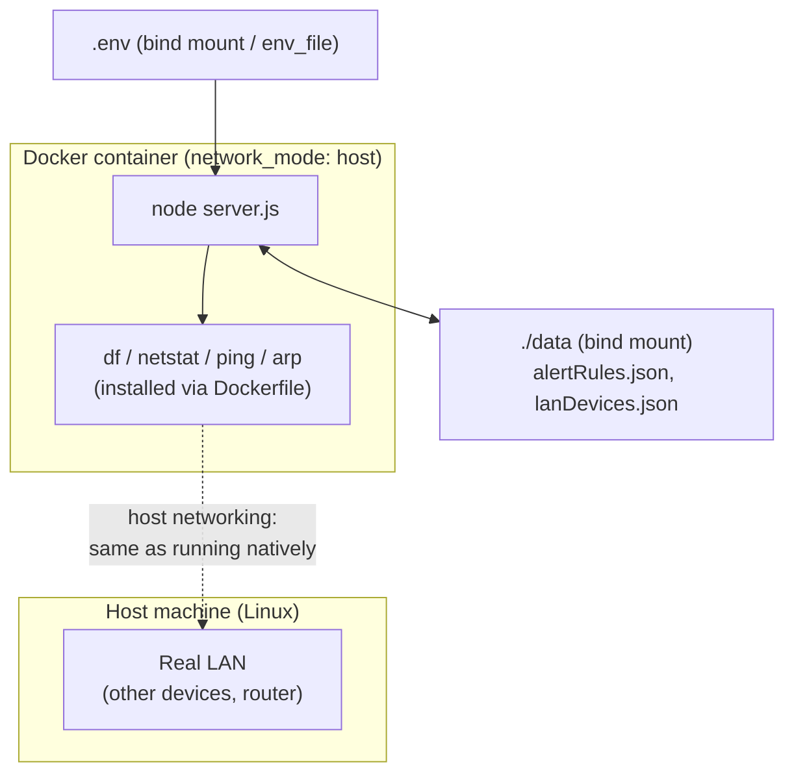

# Phase 6 Implementation Plan — Docker Support

**Status:** Design spec — no code written yet.
**Depends on:** Nothing. Phase 5 (Alerting & Notifications) is code-complete; this phase does not touch it.
**Scope:** Phase 6 in README's Roadmap lists four items — Docker support, Cloudflare Tunnel integration, a Raspberry Pi agent, and multi-node monitoring. This document covers **Docker support only**, the first of the four. The other three are not addressed here and may each want their own plan document later, the same way this one exists separately from `PHASE5_PLAN.md`.

This document is the implementation contract for Dockerizing SND@HOME. Anything not specified here (a published/prebuilt image, Kubernetes manifests, a Compose-based multi-node setup) is explicitly out of scope — see Non-objectives.

---

# Objectives

1. Let an operator run the whole app (`node server.js` plus its background pollers/engines) with `docker compose up`, without installing Node or any system dependency (`df`, `netstat`, `arp`/`ip`, `ping`) on the host directly.
2. Preserve every currently-implemented feature at parity where the container runtime allows it: system monitoring, alerting/notifications, and LAN device monitoring.
3. Don't silently degrade LAN device monitoring — if a chosen networking mode can't give the container real access to the host's LAN (see Networking Mode below), say so loudly in the README and `docker-compose.yml`'s own comments, the same way this codebase already documents the `netstat -ib` BSD-vs-Linux gap (README's "Platform note") and `lan/lanScanner.js`'s own header comment already flags this exact Docker concern as a known future issue.
4. Persist what's already persisted today (`data/alertRules.json`, `data/lanDevices.json`) across container restarts/rebuilds, via a bind-mounted `data/` directory — losing alert rules or the device ledger every redeploy would be a regression, not just a rough edge.
5. Keep the image reasonably small and the Dockerfile simple — this codebase's whole philosophy so far (`README.md`'s Tech Stack: "no frontend framework, no build step, no bundler," "keeping with the dependency-light philosophy") argues against a heavy, multi-stage build for what is fundamentally a single `npm install && node server.js` app with zero compiled/native dependencies.

**Non-objectives (deferred):** publishing a prebuilt image to Docker Hub/GHCR (no CI pipeline exists in this repo yet — see `Estimates`), Kubernetes manifests, HTTPS/TLS termination inside the container (a reverse proxy in front of it is a deployment-time decision, not this app's concern), and any change to the multi-node/Raspberry Pi items also listed under Phase 6 — those are separate, unscoped work.

---

# Central design decision: networking mode

This is the one decision that shapes everything else in this plan, and it needs sign-off before implementation starts (see `Open decisions needing sign-off` at the end) because it's a real, unavoidable trade-off, not a bug to engineer around.

`lan/lanScanner.js` finds devices by pinging every host in a subnet and cross-referencing the OS's own ARP table (`arp -an`, per `dc1138f`) — both fundamentally Layer-2/local-segment operations. Docker's **default bridge network** puts the container on its own isolated virtual subnet (typically `172.17.0.0/16`) behind NAT; from inside it, `ping`/`arp -an` can only ever see other containers on that same virtual bridge, never the real devices on the operator's actual LAN. Under the default network mode, **LAN Device Monitoring would silently return zero real devices** — not an error, just an empty, technically-correct-for-its-own-isolated-network scan. That's exactly the kind of silently-wrong result this codebase has consistently refused to ship elsewhere (see `lan/deviceStore.js`'s "safer side" MAC-exclusion design, or the `unresolvedMacCount` diagnostic added specifically so a similar gap wouldn't go unnoticed again).

Three options, evaluated against that constraint:

| Mode | LAN Device Monitoring | Portability | Notes |
|---|---|---|---|
| **`network_mode: host`** | Works exactly like running natively — the container shares the host's real network namespace | **Linux only.** Docker Desktop for Mac/Windows runs containers inside a Linux VM, so even `host` mode there means "host of the VM," not the Mac/Windows machine's real LAN | Simplest to configure (no `ports:` mapping needed — the container just binds `PORT` directly on the host) |
| **`macvlan` network** | Works — the container gets its own MAC/IP directly on the physical LAN segment | Linux only, and needs the host's physical interface name at compose-time; not supported by Docker Desktop's VM-based networking either | More setup complexity for a homelab operator than this app's "no build step, no bundler" philosophy (Objective 5) seems to warrant for a first cut |
| **Default bridge** | **Does not work** — scans only the container's own isolated virtual subnet | Fully portable (macOS/Windows/Linux, Docker Desktop included) | System monitoring and alerting still work fully; only LAN Device Monitoring is degraded |

**Recommendation:** ship `docker-compose.yml` defaulting to `network_mode: host`, documented as the supported mode for full parity (Linux hosts — which is also this project's own primary target per README's existing "macOS or Linux" requirement, Windows was never supported natively either). Document the bridge-mode fallback explicitly in README as "system monitoring and alerting work, LAN Device Monitoring will report zero devices" for anyone on Docker Desktop who wants the rest of the app containerized anyway. Not silently picking one and hiding the other's limitation.

---

# Architecture

Three new files at the repo root, none of them touching existing application code:

```
Dockerfile           # single-stage build: node:20-bookworm-slim + apt packages the collectors/scanner shell out to + npm ci + node server.js
.dockerignore         # node_modules, data/*.json (seeded fresh or bind-mounted, not baked into the image), .env, .git
docker-compose.yml    # the one supported way to run this in Docker -- host networking, .env passthrough, data/ bind mount, HEALTHCHECK
```

No application code changes are anticipated. Every system command this app shells out to (`df`, `netstat`, `ping`, `arp`, `ip`) needs to exist inside the image — that's a Dockerfile/base-image concern, not a code change, the same way this app doesn't bundle `df` for macOS today either.



---

# Base image

`node:20-bookworm-slim` (Debian, not Alpine).

**Why not `node:20-alpine`:** Alpine's userland is BusyBox, not GNU coreutils/net-tools. `collectors/diskCollector.js`'s `df -k /` parsing and `collectors/networkCollector.js`'s `netstat -ib` parsing were written and tested against macOS (BSD) output and, per README's own "Platform note," already have a known, accepted gap against Linux `net-tools`' netstat (`rxBytes`/`txBytes` can come back `null`). Introducing a *third* output dialect (BusyBox) alongside BSD and GNU/net-tools, on top of an already-flagged gap, is exactly the kind of cross-platform parsing risk this codebase's own comments (`lan/lanScanner.js`'s header, citing the netstat lesson explicitly) warn against repeating. Debian's coreutils/net-tools output matches the GNU dialect the code was already partially written against, minimizing new parsing surface. The image size difference (roughly 80MB vs 40MB base) is a non-goal trade-off worth accepting for that reduction in platform-dialect risk, consistent with Objective 5 valuing simplicity over micro-optimizing image size.

Packages the Dockerfile needs to install on top of the base image (none of these ship in `node:20-bookworm-slim` by default):

| Package (apt) | Provides | Used by |
|---|---|---|
| `iputils-ping` | `ping` | `lan/lanScanner.js` (`pingHost`) |
| `net-tools` | `arp`, `netstat` | `lan/lanScanner.js` (`readArpTable`'s primary path), `collectors/networkCollector.js` |
| `iproute2` | `ip` | `lan/lanScanner.js` (`readArpTable`'s fallback path when `arp` is unavailable) — installed anyway for defense-in-depth even though `net-tools` covers the primary path, since the fallback existing at all is exactly for cases like a future base-image change dropping `net-tools` |
| (none needed for `df`) | `df` | already in `coreutils`, part of every Debian base image |

---

# Persistence & configuration

- **`data/`** — bind-mounted (`./data:/app/data`), not a named volume: this app already treats `data/` as operator-visible, backup-able local files (`storage/`-style local-first philosophy consistent with `README`'s "no database" framing), and a bind mount keeps that property true under Docker instead of hiding state inside an opaque Docker-managed volume.
- **`.env`** — passed via Compose's `env_file: .env`, unchanged from how `dotenv` already loads it natively; no new configuration mechanism introduced. `.env` itself stays out of the image (`.dockerignore`) and is supplied by the operator at `docker compose up` time, same as today.
- **`PORT`** — respected as-is (`server.js` already reads `process.env.PORT`); under `network_mode: host` no `ports:` mapping is needed since the container binds directly on the host's `PORT`.
- **`LAN_SCAN_CIDR`** (from `613236f`) — worth calling out in the compose file's own comments as the operator's escape hatch if the host has more than one active interface and auto-detection (`lan/lanScanner.js`'s `detectLocalSubnet()`) picks the wrong one inside the container, same as it already is natively.

No new environment variables are introduced by Docker support itself — every existing one from `.env.example` continues to work unchanged.

---

# Health check

`HEALTHCHECK` wired to the already-existing `GET /api/health` (`{ "status": "ok" }`, per README's API table) — no new endpoint needed:

```dockerfile
HEALTHCHECK --interval=30s --timeout=5s --start-period=10s --retries=3 \
  CMD node -e "require('http').get('http://localhost:'+(process.env.PORT||3000)+'/api/health',r=>process.exit(r.statusCode===200?0:1)).on('error',()=>process.exit(1))"
```

Uses `node -e` rather than `curl`/`wget` specifically so the image doesn't need either installed just for this — `node` is already there by definition.

---

# File Structure

```
SND_HOME/
├── Dockerfile                    # node:20-bookworm-slim, apt packages, npm ci, HEALTHCHECK
├── .dockerignore                 # node_modules, data/*.json, .env, .git, *.bak
├── docker-compose.yml            # network_mode: host, env_file, data/ bind mount
```

No changes to any existing file's *behavior* are anticipated. README gets a new `## 🐳 Docker` usage section (mirroring the existing `## 🚀 Installation` section's style) documenting both the host-networking (full-parity) and bridge-networking (LAN monitoring degraded) paths explicitly, per Objective 3.

---

# Implementation Order

**Environment note, added when this plan was executed:** the machine this was implemented on has no `docker` binary installed at all (confirmed via `which docker`/`docker --version`). Stages 1, 3, and 4 below involve real `docker build`/`docker compose up`/real-network verification that **could not be run** as a result — marked `[x] written` where the file/config was produced, but their own `Verify:` lines are explicitly **not** satisfied. This is flagged here rather than silently left implicit, the same way this project has consistently distinguished "code written" from "verified" elsewhere (e.g. `PHASE5_PLAN.md` Stage 8.1/8.2's live-credential gate). Whoever has a Docker-capable host needs to actually run Stages 1/3/4's verification steps before Roadmap's `[ ] Docker support` line can honestly become `[x]`.

### Stage 0 — Prerequisites
- [x] None. This phase has no dependency on any unmerged work.

### Stage 1 — Dockerfile *(45 min)*
- [x] Single-stage build from `node:20-bookworm-slim`
- [x] `apt-get install` the three packages from the Base Image table, in one layer, with `--no-install-recommends` and cleaning `/var/lib/apt/lists/*` afterward to keep the image lean
- [x] `npm ci --omit=dev` (this app's `devDependencies` — currently just `supertest` — are test-only, never needed at runtime)
- [x] `HEALTHCHECK` per above
- [x] `CMD ["node", "server.js"]`
- Verify: `docker build` succeeds; `docker run` (bridge mode, default) boots and serves `GET /api/health` with `200` — **NOT RUN, no Docker on this machine.** Manually reviewed the Dockerfile line by line instead; no automated substitute for an actual build exists here (no `hadolint` either)

### Stage 2 — `.dockerignore` *(10 min)*
- [x] `node_modules/`, `data/*.json`, `data/*.log`, `.env`, `.git/`, `*.bak`, `.claude/`
- Verify: build context size drops noticeably; confirm host `data/*.json` isn't baked into the image — **NOT RUN** (same reason as Stage 1; this step only matters once an actual build runs)

### Stage 3 — `docker-compose.yml` *(30 min)*
- [x] `network_mode: host` (documented as the default/recommended path per the Central Design Decision)
- [x] `env_file: .env`
- [x] `volumes: ["./data:/app/data"]`
- [x] `restart: unless-stopped` (this is meant to run as a long-lived homelab service, matching how `lan/lanEngine.js`/`monitor/monitorEngine.js` are themselves designed as always-on loops, not one-shot jobs)
- [x] Bridge-mode fallback left in as a commented-out `ports:` block, per the README section this stage also wrote
- Verify: `docker compose up` boots the full app; `curl http://localhost:3000/api/health` from the host succeeds; alert rules created via the API survive a `docker compose down && docker compose up` — **NOT RUN, no Docker on this machine.** Did confirm `docker-compose.yml` is valid YAML (`python3 -c "import yaml; yaml.safe_load(...)"`) and parses to the expected structure — that's a syntax check, not a functional one

### Stage 4 — LAN Device Monitoring parity check (host mode) *(30 min)*
- [ ] Run the containerized app (host mode, real machine, real LAN — same setup already used to verify `dc1138f`/`ec2e70f`) and confirm `GET /api/lan/status` reports the same `onlineCount`/`knownDeviceCount` as the native (non-Docker) run
- [ ] Separately run in default bridge mode and confirm the *documented* degradation actually happens as described (onlineCount stays 0, not a crash) — proving the README's warning is accurate, not just asserted
- Verify: **NOT RUN AT ALL, no Docker available.** This is the stage that most needs a real run — it's the empirical claim (host mode = full parity, bridge mode = zero devices) the whole README section and the Central Design Decision above rest on, and right now that claim is reasoned from how Docker networking works in general, not proven against this app specifically the way `dc1138f`'s fix was

### Stage 5 — README documentation *(30 min)*
- [x] New `## 🐳 Docker` section: `docker compose up` quick start, the host-vs-bridge trade-off table from this doc, a note that `LAN_SCAN_CIDR` is the operator's escape hatch for multi-interface hosts
- [x] Added Docker to Tech Stack; Roadmap's `[ ] Docker support` line left **unchecked**, with a note explaining why (see Environment note above) rather than checked prematurely
- [x] Re-read the full section for internal consistency with the Networking Mode table above

### Stage 6 — Regression check *(15 min)*
- [x] `npm test` → **356/356**, unaffected (confirms no application code changed, verifiable without Docker)
- [x] Confirmed no `server.js`/`package.json` changes were made by this plan (`git diff` shows only new files: `Dockerfile`, `.dockerignore`, `docker-compose.yml`, `PHASE6_DOCKER_PLAN.md`, plus `README.md` doc edits)

---

# Open decisions needing sign-off (before Stage 1 starts)

Raised before implementation, the same way this project has consistently raised real trade-offs to the user rather than silently picking one (Stage 8's manual-E2E deferral, Stage 10's opt-in-auth decision, Task C's provider-enum "kept as-is" call in the sibling Takomachi project). **Resolved — user confirmed all three recommended defaults before Stage 1 began:**

1. **Default networking mode: `network_mode: host`.** ~~ship `network_mode: host` as the documented default (full LAN parity, Linux-only), or default to bridge (fully portable, LAN Device Monitoring degraded to zero) and make `host` the opt-in?~~ **Decided: `host`.**
2. **Base image: `node:20-bookworm-slim`.** ~~vs `node:20-alpine` (smaller, but a third ping/arp/netstat output dialect to trust)~~ **Decided: Debian-slim, per the recommendation above.**
3. **Prebuilt/published image: out of scope for this pass.** No CI/publishing pipeline exists in this repo yet (see Estimates' Risk note) — confirmed acceptable as a later follow-up, not part of this phase.

---

# Estimates

| | |
|---|---|
| **Total tasks** | 6 stages, all required (no stretch items — Docker support as scoped here is small enough not to warrant splitting further) |
| **Total implementation time** | ~2.5–3 hours, including the two verification stages against a real network |
| **Risk** | **Low-Medium.** The one real risk concentration is the networking-mode trade-off itself (Central Design Decision) — not a bug to fix, a limitation to document accurately, which Stage 4 exists specifically to verify empirically rather than take on faith. Secondary, smaller risk: apt package versions in `node:20-bookworm-slim` producing `arp`/`netstat` output that drifts from what `lan/lanScanner.js`'s parsers (`parseArpTable`/`parseIpNeighTable`) expect — mitigated by Stage 4's real-network verification, the same empirical bar `dc1138f` was held to, not a mocked test. No CI publishing pipeline exists in this repo (unlike the sibling Takomachi project, which has `.github/workflows/ci.yml`) — publishing a prebuilt image is out of scope for this reason, not forgotten. |
| **Complexity** | **Low.** This app has no compiled/native dependencies and no build step (README's own "no build step, no bundler" framing extends cleanly to a single-stage Dockerfile). The complexity here is almost entirely in the networking-mode decision and its documentation, not the container mechanics themselves. |
