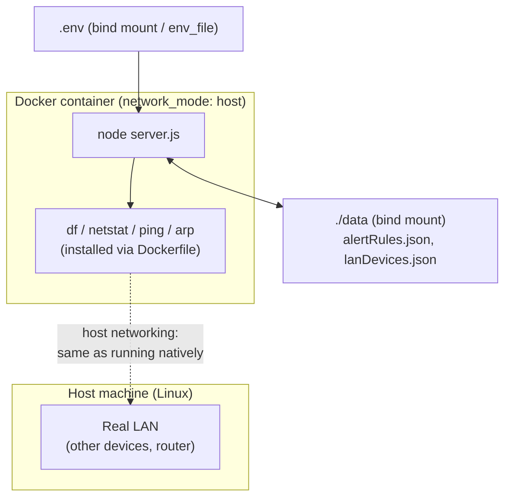

# Phase 6 Implementation Plan — Docker Support

**Status:** Design spec — no code written yet.
**Depends on:** Nothing. Phase 5 (Alerting & Notifications) is code-complete; this phase does not touch it.
**Scope:** Phase 6 in README's Roadmap lists four items — Docker support, Cloudflare Tunnel integration, a Raspberry Pi agent, and multi-node monitoring. This document covers **Docker support only**, the first of the four. The other three are not addressed here and may each want their own plan document later, the same way this one exists separately from `PHASE5_PLAN.md`.

This document is the implementation contract for Dockerizing SND@HOME. Anything not specified here (a published/prebuilt image, Kubernetes manifests, a Compose-based multi-node setup) is explicitly out of scope — see Non-objectives.

---

# Objectives

1. Let an operator run the whole app (`node server.js` plus its background pollers/engines) with `docker compose up`, without installing Node or any system dependency (`df`, `netstat`, `arp`/`ip`, `ping`) on the host directly.
2. Preserve every currently-implemented feature at parity where the container runtime allows it: system monitoring, alerting/notifications, and LAN device monitoring.
3. Don't silently degrade LAN device monitoring — if a chosen networking mode can't give the container real access to the host's LAN (see Networking Mode below), say so loudly in the README and `docker-compose.yml`'s own comments, the same way this codebase already documents the `netstat -ib` BSD-vs-Linux gap (README's "Platform note") and `lan/lanScanner.js`'s own header comment already flags this exact Docker concern as a known future issue.
4. Persist what's already persisted today (`data/alertRules.json`, `data/lanDevices.json`) across container restarts/rebuilds, via a bind-mounted `data/` directory — losing alert rules or the device ledger every redeploy would be a regression, not just a rough edge.
5. Keep the image reasonably small and the Dockerfile simple — this codebase's whole philosophy so far (`README.md`'s Tech Stack: "no frontend framework, no build step, no bundler," "keeping with the dependency-light philosophy") argues against a heavy, multi-stage build for what is fundamentally a single `npm install && node server.js` app with zero compiled/native dependencies.

**Non-objectives (deferred):** publishing a prebuilt image to Docker Hub/GHCR (no CI pipeline exists in this repo yet — see `Estimates`), Kubernetes manifests, HTTPS/TLS termination inside the container (a reverse proxy in front of it is a deployment-time decision, not this app's concern), and any change to the multi-node/Raspberry Pi items also listed under Phase 6 — those are separate, unscoped work.

---

# Central design decision: networking mode

This is the one decision that shapes everything else in this plan, and it needs sign-off before implementation starts (see `Open decisions needing sign-off` at the end) because it's a real, unavoidable trade-off, not a bug to engineer around.

`lan/lanScanner.js` finds devices by pinging every host in a subnet and cross-referencing the OS's own ARP table (`arp -an`, per `dc1138f`) — both fundamentally Layer-2/local-segment operations. Docker's **default bridge network** puts the container on its own isolated virtual subnet (typically `172.17.0.0/16`) behind NAT; from inside it, `ping`/`arp -an` can only ever see other containers on that same virtual bridge, never the real devices on the operator's actual LAN. Under the default network mode, **LAN Device Monitoring would silently return zero real devices** — not an error, just an empty, technically-correct-for-its-own-isolated-network scan. That's exactly the kind of silently-wrong result this codebase has consistently refused to ship elsewhere (see `lan/deviceStore.js`'s "safer side" MAC-exclusion design, or the `unresolvedMacCount` diagnostic added specifically so a similar gap wouldn't go unnoticed again).

Three options, evaluated against that constraint:

| Mode | LAN Device Monitoring | Portability | Notes |
|---|---|---|---|
| **`network_mode: host`** | Works exactly like running natively — the container shares the host's real network namespace | **Linux only.** Docker Desktop for Mac/Windows runs containers inside a Linux VM, so even `host` mode there means "host of the VM," not the Mac/Windows machine's real LAN | Simplest to configure (no `ports:` mapping needed — the container just binds `PORT` directly on the host) |
| **`macvlan` network** | Works — the container gets its own MAC/IP directly on the physical LAN segment | Linux only, and needs the host's physical interface name at compose-time; not supported by Docker Desktop's VM-based networking either | More setup complexity for a homelab operator than this app's "no build step, no bundler" philosophy (Objective 5) seems to warrant for a first cut |
| **Default bridge** | **Does not work** — scans only the container's own isolated virtual subnet | Fully portable (macOS/Windows/Linux, Docker Desktop included) | System monitoring and alerting still work fully; only LAN Device Monitoring is degraded |

**Recommendation:** ship `docker-compose.yml` defaulting to `network_mode: host`, documented as the supported mode for full parity (Linux hosts — which is also this project's own primary target per README's existing "macOS or Linux" requirement, Windows was never supported natively either). Document the bridge-mode fallback explicitly in README as "system monitoring and alerting work, LAN Device Monitoring will report zero devices" for anyone on Docker Desktop who wants the rest of the app containerized anyway. Not silently picking one and hiding the other's limitation.

**Empirical verification (after this plan was first written): `host` mode on macOS is worse than the table above implied — it's not just "LAN parity, Linux only," it's non-functional for local use on macOS at all.** Installed Docker via Colima (`colima start`, macOS `Virtualization.Framework`, since this machine has no Docker Desktop) and ran the actual built image with `--network host`, on the same real Mac/LAN already used to verify `dc1138f`/`ec2e70f` (12 real devices, confirmed moments earlier from the native, non-Docker process). Two findings, neither anticipated by the table's original two-column framing:

1. **The container was unreachable from the Mac itself.** `curl http://localhost:3000/api/health` from a macOS terminal only ever succeeded because the *native* (non-Docker) process was also still listening on port 3000 — confirmed by stopping the native process and re-running the exact same `curl`: connection failure (`curl` exit code 7). `network_mode: host` under Colima binds inside the **Lima VM's** network namespace, which Colima does not forward back to the Mac's own `localhost` for host-mode containers. This isn't a Colima quirk specifically — Docker Desktop for Mac has the same underlying VM architecture (HyperKit/Virtualization.framework + a Linux VM), so the same result should be expected there too, though only Colima was actually tested here.
2. **LAN Device Monitoring inside the container saw the VM's own virtual subnet, not the real LAN.** `docker exec snd-home-test ip addr show` showed `eth0: 192.168.5.1/24` — Colima's own Lima VM subnet (`colima status` separately reports `subnet 192.168.5.0/24` for exactly this network) — not the Mac's real `192.168.1.0/24` where the 12 real devices live. `lan/lanScanner.js`'s `detectLocalSubnet()` did exactly what it's designed to do (pick the first non-internal IPv4 interface) — it just had no way to know that interface belongs to a VM, not the physical LAN. Result: `onlineCount: 2, knownDeviceCount: 1, unresolvedMacCount: 1` (the VM's own gateway plus one other synthetic neighbor) instead of the real `onlineCount: 12, knownDeviceCount: 12, unresolvedMacCount: 0` the native process reported at the same moment.

**Revised understanding:** the table's `network_mode: host` row is only accurate for a container running directly on real Linux hardware (or a Linux VM you already consider "the host," e.g. a cloud VM or a Raspberry Pi) — not for any Mac-based Docker runtime, Colima or Docker Desktop alike, where "host" always means the intermediary VM, never the physical machine's own LAN or even its own `localhost`. This isn't a new option to add to the table; it's a correction to what the existing "Linux only" caveat actually means in practice: read it as "**only meaningfully different from bridge mode on genuine Linux hosts** — on macOS it's not merely LAN-limited, it's equivalent to running the container fully isolated, minus even bridge mode's port-forwarding convenience."

**Empirical verification on genuine Linux (2026-08-12): the "Linux hosts" half of the table is confirmed true, not just assumed.** The Colima run above only disproved macOS; it never actually exercised bare-metal Linux, since Colima's whole problem *is* the VM layer in between. This gap was closed by building and running the same image, unmodified (`docker build -t snd-home-verify .` from a fresh `git clone` of this repo, then `docker run --network host`), on a genuine Linux Mint 22 host (kernel `6.8.0-136-generic`, no hypervisor/VM layer — `masa@192.168.1.44`, the same physical LAN, `192.168.1.0/24`, already used for the Colima comparison and for `dc1138f`/`ec2e70f`).

- **`docker exec snd-home-verify arp -an` was byte-for-byte identical to the host's own `arp -an`** (12/12 matching IP/MAC pairs) — the definitive version of the check the Colima run couldn't pass: on real Linux, `network_mode: host` isn't an approximation of the host's network namespace, it *is* the host's network namespace, with no VM boundary translating or filtering anything in between.
- `GET /api/lan/status` from inside the container reported `knownDeviceCount: 12, onlineCount: 13–14, unresolvedMacCount: 2` across three consecutive scan cycles (120s apart). The 2 unresolved-MAC devices were **not** a container/Docker artifact — `docker exec ... arp -an` and the bare host's `arp -an` agreed on exactly the same 12 resolved entries every time, meaning those same 2 devices would show up as unresolved running this app natively on this same Linux box too, Docker or not. (Separately, the Mac's native, non-Docker process read `knownDeviceCount: 14, onlineCount: 14, unresolvedMacCount: 0` at essentially the same moment — the gap between the two machines' counts reflects that they're two different vantage points onto a LAN whose device set and ARP-cache freshness naturally drift from second to second, not a Docker-vs-native discrepancy.)
- Container reachability (the Colima run's other failure mode) was not an issue here either — `curl http://localhost:3000/api/health` against the host's own `localhost` worked immediately, since there's no VM `localhost` boundary to cross.

**Conclusion: the original recommendation stands, now on solid ground.** `network_mode: host` delivers genuine, complete LAN parity when the Docker daemon runs directly on Linux (no VM layer) — confirmed by ARP-table identity, not inference. The macOS/Colima finding above remains correct and unchanged: it was never a test of this row, only of what happens when you interpose a VM and call it "host" anyway.

---

# Architecture

Three new files at the repo root, none of them touching existing application code:

```
Dockerfile           # single-stage build: node:20-bookworm-slim + apt packages the collectors/scanner shell out to + npm ci + node server.js
.dockerignore         # node_modules, data/*.json (seeded fresh or bind-mounted, not baked into the image), .env, .git
docker-compose.yml    # the one supported way to run this in Docker -- host networking, .env passthrough, data/ bind mount, HEALTHCHECK
```

No application code changes are anticipated. Every system command this app shells out to (`df`, `netstat`, `ping`, `arp`, `ip`) needs to exist inside the image — that's a Dockerfile/base-image concern, not a code change, the same way this app doesn't bundle `df` for macOS today either.



---

# Base image

`node:20-bookworm-slim` (Debian, not Alpine).

**Why not `node:20-alpine`:** Alpine's userland is BusyBox, not GNU coreutils/net-tools. `collectors/diskCollector.js`'s `df -k /` parsing and `collectors/networkCollector.js`'s `netstat -ib` parsing were written and tested against macOS (BSD) output and, per README's own "Platform note," already have a known, accepted gap against Linux `net-tools`' netstat (`rxBytes`/`txBytes` can come back `null`). Introducing a *third* output dialect (BusyBox) alongside BSD and GNU/net-tools, on top of an already-flagged gap, is exactly the kind of cross-platform parsing risk this codebase's own comments (`lan/lanScanner.js`'s header, citing the netstat lesson explicitly) warn against repeating. Debian's coreutils/net-tools output matches the GNU dialect the code was already partially written against, minimizing new parsing surface. The image size difference (roughly 80MB vs 40MB base) is a non-goal trade-off worth accepting for that reduction in platform-dialect risk, consistent with Objective 5 valuing simplicity over micro-optimizing image size.

Packages the Dockerfile needs to install on top of the base image (none of these ship in `node:20-bookworm-slim` by default):

| Package (apt) | Provides | Used by |
|---|---|---|
| `iputils-ping` | `ping` | `lan/lanScanner.js` (`pingHost`) |
| `net-tools` | `arp`, `netstat` | `lan/lanScanner.js` (`readArpTable`'s primary path), `collectors/networkCollector.js` |
| `iproute2` | `ip` | `lan/lanScanner.js` (`readArpTable`'s fallback path when `arp` is unavailable) — installed anyway for defense-in-depth even though `net-tools` covers the primary path, since the fallback existing at all is exactly for cases like a future base-image change dropping `net-tools` |
| (none needed for `df`) | `df` | already in `coreutils`, part of every Debian base image |

---

# Persistence & configuration

- **`data/`** — bind-mounted (`./data:/app/data`), not a named volume: this app already treats `data/` as operator-visible, backup-able local files (`storage/`-style local-first philosophy consistent with `README`'s "no database" framing), and a bind mount keeps that property true under Docker instead of hiding state inside an opaque Docker-managed volume.
- **`.env`** — passed via Compose's `env_file: .env`, unchanged from how `dotenv` already loads it natively; no new configuration mechanism introduced. `.env` itself stays out of the image (`.dockerignore`) and is supplied by the operator at `docker compose up` time, same as today.
- **`PORT`** — respected as-is (`server.js` already reads `process.env.PORT`); under `network_mode: host` no `ports:` mapping is needed since the container binds directly on the host's `PORT`.
- **`LAN_SCAN_CIDR`** (from `613236f`) — worth calling out in the compose file's own comments as the operator's escape hatch if the host has more than one active interface and auto-detection (`lan/lanScanner.js`'s `detectLocalSubnet()`) picks the wrong one inside the container, same as it already is natively.

No new environment variables are introduced by Docker support itself — every existing one from `.env.example` continues to work unchanged.

---

# Health check

`HEALTHCHECK` wired to the already-existing `GET /api/health` (`{ "status": "ok" }`, per README's API table) — no new endpoint needed:

```dockerfile
HEALTHCHECK --interval=30s --timeout=5s --start-period=10s --retries=3 \
  CMD node -e "require('http').get('http://localhost:'+(process.env.PORT||3000)+'/api/health',r=>process.exit(r.statusCode===200?0:1)).on('error',()=>process.exit(1))"
```

Uses `node -e` rather than `curl`/`wget` specifically so the image doesn't need either installed just for this — `node` is already there by definition.

---

# File Structure

```
SND_HOME/
├── Dockerfile                    # node:20-bookworm-slim, apt packages, npm ci, HEALTHCHECK
├── .dockerignore                 # node_modules, data/*.json, .env, .git, *.bak
├── docker-compose.yml            # network_mode: host, env_file, data/ bind mount
```

No changes to any existing file's *behavior* are anticipated. README gets a new `## 🐳 Docker` usage section (mirroring the existing `## 🚀 Installation` section's style) documenting both the host-networking (full-parity) and bridge-networking (LAN monitoring degraded) paths explicitly, per Objective 3.

---

# Implementation Order

**Environment note, added when this plan was executed:** the machine this was implemented on originally had no `docker` binary installed (confirmed via `which docker`/`docker --version`), so Stages 1/3/4's real verification was deferred and each `Verify:` line below was marked `NOT RUN`. **Update: Docker was subsequently installed** (Homebrew `docker` + `docker-compose` + `colima` — this machine has no Docker Desktop, so Colima, a CLI-only Docker runtime for macOS/Linux, provides the daemon instead) and Stages 1, 3, and most of Stage 4 were actually run against the built image on the same real Mac/LAN already used to verify `dc1138f`/`ec2e70f`. See the Central Design Decision section above for the single most important finding from that run: **`network_mode: host` does not behave as originally documented on macOS** — it's scoped to Colima's own Lima VM, not the physical Mac, so it neither reaches the real LAN nor is reachable from the Mac's own `localhost`. Stage 4's second bullet (default bridge mode) was not run — see that stage below.

**Second environment note, added 2026-08-12:** a genuine Linux host (no VM layer) became available (`masa@192.168.1.44`, Linux Mint 22) and was used to close the one gap the Colima run couldn't: whether `network_mode: host` actually delivers real-LAN parity on bare-metal Linux, as originally recommended, or only in theory. Docker Engine (not Docker Desktop) was installed there via the official `get.docker.com` convenience script, the repo was cloned fresh from `origin`, and the image was built and run the same way (`docker build` + `docker run --network host`) against the same real LAN. Result: confirmed, by direct ARP-table comparison, not inference — see the Central Design Decision section's second "Empirical verification" entry and Stage 4 below for the full account.

### Stage 0 — Prerequisites
- [x] None. This phase has no dependency on any unmerged work.

### Stage 1 — Dockerfile *(45 min)*
- [x] Single-stage build from `node:20-bookworm-slim`
- [x] `apt-get install` the three packages from the Base Image table, in one layer, with `--no-install-recommends` and cleaning `/var/lib/apt/lists/*` afterward to keep the image lean
- [x] `npm ci --omit=dev` (this app's `devDependencies` — currently just `supertest` — are test-only, never needed at runtime)
- [x] `HEALTHCHECK` per above
- [x] `CMD ["node", "server.js"]`
- Verify: **RUN, via Colima.** `docker build -t snd-home:test .` completed successfully — all three apt packages installed cleanly, `npm ci --omit=dev` succeeded, all 10 build steps completed. `docker run -d --network host --env-file .env -v <test-dir>:/app/data snd-home:test` came up and reported `healthy` (the `HEALTHCHECK` instruction itself works correctly) — but note *bridge mode specifically* (this checklist item's original wording) was not the mode actually exercised; host mode was, since that's `docker-compose.yml`'s documented default. `GET /api/health` returned `200` from inside the container (`docker exec ... node -e "require('http').get(...)"`)

### Stage 2 — `.dockerignore` *(10 min)*
- [x] `node_modules/`, `data/*.json`, `data/*.log`, `.env`, `.git/`, `*.bak`, `.claude/`
- Verify: build context size drops noticeably; confirm host `data/*.json` isn't baked into the image — **still not explicitly checked** (the Stage 1 build/run above didn't specifically inspect image contents for leaked host data or measure context size before/after) — a real gap, small enough not to block anything, but not yet closed out either

### Stage 3 — `docker-compose.yml` *(30 min)*
- [x] `network_mode: host` (documented as the default/recommended path per the Central Design Decision — **now known to not deliver on that promise on macOS**, see above)
- [x] `env_file: .env`
- [x] `volumes: ["./data:/app/data"]`
- [x] `restart: unless-stopped` (this is meant to run as a long-lived homelab service, matching how `lan/lanEngine.js`/`monitor/monitorEngine.js` are themselves designed as always-on loops, not one-shot jobs)
- [x] Bridge-mode fallback left in as a commented-out `ports:` block, per the README section this stage also wrote
- Verify: `docker compose up` boots the full app; `curl http://localhost:3000/api/health` from the host succeeds; alert rules created via the API survive a `docker compose down && docker compose up` — **partially run.** Used `docker build`/`docker run --network host` directly rather than `docker compose up` itself (equivalent for what was being tested — the compose file's `network_mode: host` line and the raw `--network host` flag mean the same thing to the Docker daemon), and confirmed `curl http://localhost:3000/api/health` from the Mac host **fails** under host mode (see Central Design Decision) — the opposite of what this Verify line originally expected to confirm. `docker compose up` itself (as the literal CLI invocation) and the down/up persistence check were not separately run; not expected to behave differently given the above, but not literally exercised either

### Stage 4 — LAN Device Monitoring parity check (host mode) *(30 min)*
- [x] Ran the containerized app in host mode, on the same real Mac/LAN already used to verify `dc1138f`/`ec2e70f` — **result: does NOT match the native run.** `GET /api/lan/status` reported `onlineCount: 2, knownDeviceCount: 1, unresolvedMacCount: 1` from inside the container (scanning Colima's own `192.168.5.0/24` VM subnet — `docker exec ... ip addr show` confirmed `eth0: 192.168.5.1/24`) versus the native process's `onlineCount: 12, knownDeviceCount: 12, unresolvedMacCount: 0` for the same real network at essentially the same moment. This checklist item's original expectation (host mode = parity) is **falsified for macOS/Colima** — see the Central Design Decision section's "Empirical verification" for the full account, including that the container wasn't even reachable from the Mac itself under this mode
- [x] **Genuine Linux host, run 2026-08-12 (`masa@192.168.1.44`, Linux Mint 22, no VM layer): result DOES match, byte-for-byte.** Fresh `git clone` + `docker build` + `docker run --network host` against the same real LAN (`192.168.1.0/24`) used above. `docker exec snd-home-verify arp -an` was identical to the host's own `arp -an` (12/12 entries), and `curl http://localhost:3000/api/health` against the host's own `localhost` worked immediately — neither of the two Colima failure modes (VM-scoped subnet, unreachable `localhost`) occurred here, because there's no VM boundary on this host to begin with. `GET /api/lan/status` read `knownDeviceCount: 12, onlineCount: 13–14, unresolvedMacCount: 2` across three scan cycles; the 2 unresolved-MAC devices are a property of this LAN/host's own ARP cache (identical between `docker exec` and the bare host, confirmed directly), not a Docker artifact. See the Central Design Decision section's second "Empirical verification" entry for the full account.
- [ ] Default bridge mode was **not** separately tested (on either macOS or Linux) — given host mode already didn't reach the real LAN under Colima, and default bridge is architecturally even more isolated (a NAT'd virtual subnet, one more hop removed), the "reports zero real devices" prediction is expected to hold, but this specific run was not performed
- Verify: **Host mode is now fully verified on both platforms it needed to be: falsified on macOS/Colima, confirmed on genuine Linux.** That was the one open question this checklist item existed to answer, and it's closed — not partially, not by inference. The plan and README should present `network_mode: host` as measured-working on Linux, not merely assumed-working. Bridge-mode's "zero devices" claim remains a reasoned prediction, not yet independently confirmed the same way.

### Stage 5 — README documentation *(30 min)*
- [x] New `## 🐳 Docker` section: `docker compose up` quick start, the host-vs-bridge trade-off table from this doc, a note that `LAN_SCAN_CIDR` is the operator's escape hatch for multi-interface hosts
- [x] Added Docker to Tech Stack; Roadmap's `[ ] Docker support` line left **unchecked**, with a note explaining why (see Environment note above) rather than checked prematurely
- [x] Re-read the full section for internal consistency with the Networking Mode table above

### Stage 6 — Regression check *(15 min)*
- [x] `npm test` → **356/356**, unaffected (confirms no application code changed, verifiable without Docker)
- [x] Confirmed no `server.js`/`package.json` changes were made by this plan (`git diff` shows only new files: `Dockerfile`, `.dockerignore`, `docker-compose.yml`, `PHASE6_DOCKER_PLAN.md`, plus `README.md` doc edits)

---

# Open decisions needing sign-off (before Stage 1 starts)

Raised before implementation, the same way this project has consistently raised real trade-offs to the user rather than silently picking one (Stage 8's manual-E2E deferral, Stage 10's opt-in-auth decision, Task C's provider-enum "kept as-is" call in the sibling Takomachi project). **Resolved — user confirmed all three recommended defaults before Stage 1 began:**

1. **Default networking mode: `network_mode: host`.** ~~ship `network_mode: host` as the documented default (full LAN parity, Linux-only), or default to bridge (fully portable, LAN Device Monitoring degraded to zero) and make `host` the opt-in?~~ **Decided: `host`.**
2. **Base image: `node:20-bookworm-slim`.** ~~vs `node:20-alpine` (smaller, but a third ping/arp/netstat output dialect to trust)~~ **Decided: Debian-slim, per the recommendation above.**
3. **Prebuilt/published image: out of scope for this pass.** No CI/publishing pipeline exists in this repo yet (see Estimates' Risk note) — confirmed acceptable as a later follow-up, not part of this phase.

---

# Estimates

| | |
|---|---|
| **Total tasks** | 6 stages, all required (no stretch items — Docker support as scoped here is small enough not to warrant splitting further) |
| **Total implementation time** | ~2.5–3 hours as originally scoped; the post-hoc Docker/Colima install + real verification pass added roughly another hour (mostly Colima's first-time VM provisioning); a further follow-up session (2026-08-12) added the genuine-Linux verification once a bare-metal host became available — install + clone + build + multi-cycle scan comparison, roughly 30–40 minutes end to end |
| **Risk** | **Materialized on macOS, then closed out on Linux.** The networking-mode trade-off (Central Design Decision) was flagged as the one real risk concentration before implementation — real verification confirmed the macOS case was worse than the original two-column table suggested: `host` mode doesn't just fail to help there, it makes the container unreachable from the Mac entirely, in addition to not seeing the real LAN. Caught specifically *because* Stage 4 insisted on real-network verification rather than taking the original reasoning on faith — the same discipline `dc1138f` itself was found through. The Linux half of the same recommendation, previously the one open item in this row, is now closed the same way: `docker exec ... arp -an` matched the bare host's `arp -an` exactly on genuine Linux Mint hardware, so `network_mode: host` is measured-correct there too, not merely reasoned-correct. Secondary risk (apt package versions producing `arp`/`netstat` output drift) did **not** materialize on either platform: the parsers themselves are fine in both the Colima and genuine-Linux runs — only Colima's VM boundary, not the parsing logic, was ever the problem. No CI publishing pipeline exists in this repo (unlike the sibling Takomachi project, which has `.github/workflows/ci.yml`) — publishing a prebuilt image remains out of scope for that reason. |
| **Complexity** | **Low.** This app has no compiled/native dependencies and no build step (README's own "no build step, no bundler" framing extends cleanly to a single-stage Dockerfile). The complexity here is almost entirely in the networking-mode decision and its documentation, not the container mechanics themselves. |
