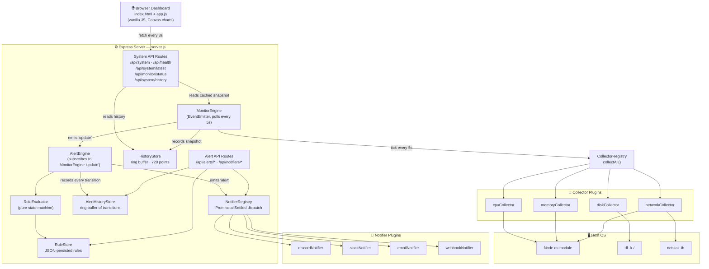
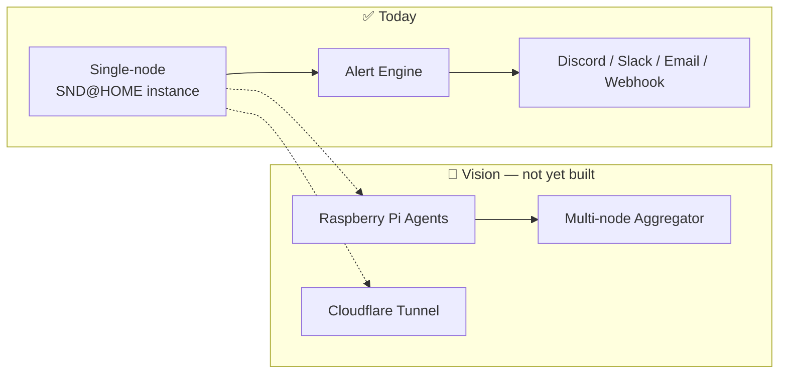

<div align="center">

# ⌂ SND@HOME

### AI-powered Home Infrastructure Monitoring Platform

**Turn your home server into a real, observable piece of infrastructure — no SaaS, no agents phoning home, no subscription.**

[](LICENSE)
[](https://nodejs.org)
[](https://developer.mozilla.org/en-US/docs/Web/JavaScript)
[](https://expressjs.com)
[](#contributing)
[](#contributing)

</div>

---

## Why SND@HOME?

Most home labs end up with the same story: a server quietly running in a closet, and no idea whether it's healthy until something breaks. Cloud monitoring SaaS is overkill for a single box, and most self-hosted dashboards are either bloated or dead projects.

**SND@HOME** starts from the opposite direction: a small, dependency-light Express server that polls your machine's vitals on a background loop, keeps a rolling history in memory, and serves it all through a clean REST API and a zero-framework live dashboard — plus a threshold-based alert engine that pages you on Discord, Slack, email, or a generic webhook when something actually needs attention. No database (metrics — alert rules are the one exception, persisted to a JSON file). No external services required. No build step. Clone it, `npm start`, and you have a live, alerting view of your box in your browser.

It's built as a **plugin-based architecture** from day one — new metrics are `register()`-ed into the collector engine, new notification channels are `register()`-ed into the notifier registry, both without touching the polling loop, the alert engine, the API, or the dashboard. That's the foundation the roadmap below (multi-node monitoring, Raspberry Pi agents) builds on.

---

## ✨ Features

### Current (implemented)

| Feature | Description |
|---|---|
| 🖥️ **System Monitoring** | Hostname, platform, load average, and uptime via Node's `os` module |
| 🔥 **CPU Monitoring** | Real usage % computed from two `os.cpus()` samples 100ms apart, plus core count |
| 🧠 **Memory Monitoring** | Used / total / percent from `os.totalmem()` / `os.freemem()` |
| 💾 **Disk Monitoring** | Used / total / percent parsed from `df -k /` |
| 🌐 **Network Monitoring** | Interfaces, local IP, and cumulative rx/tx bytes (via `netstat -ib`) |
| ⚙️ **Background Polling Engine** | Event-driven `MonitorEngine` polls all collectors every 5s and caches the latest snapshot in memory |
| 📜 **Historical Metrics** | Ring-buffer history store (720 points ≈ 1 hour at 5s intervals) for trend charts |
| 🔌 **REST API** | JSON endpoints for live snapshot, cached snapshot, history, and engine status |
| 📊 **Real-time Dashboard** | Dependency-free HTML/CSS/JS UI with live progress bars and Canvas-drawn trend charts, auto-refreshing every 3s |
| ❤️ **Health Check** | Simple `/api/health` endpoint for uptime checks / container orchestration |
| 🚨 **Alert Engine** | Threshold-based rule evaluator (`OK → FIRING → DOWN → RECOVERING → OK`) with duration/hysteresis/cooldown debouncing, driven by the same 5s poll tick |
| 📐 **Alert Rules API** | Full CRUD (`/api/alerts/rules`) for threshold rules, persisted to JSON with write-through, seeded with sane disk/CPU/memory defaults on first run |
| 📜 **Alert History** | Ring-buffer log of every state transition (`/api/alerts/history`), independent of the live metrics history |
| 💬 **Discord Notifications** | Color-coded embed per alert, via a `fetch` POST to a Discord webhook |
| 💬 **Slack Notifications** | Plain-text message via a Slack Incoming Webhook |
| 📧 **Email Notifications** | SMTP delivery via `nodemailer`, configurable host/port/auth |
| 🪝 **Generic Webhook Notifications** | Raw JSON POST to any endpoint, optionally HMAC-SHA256 signed (`X-SND-Signature`) for PagerDuty/Opsgenie/custom receivers |
| 🔌 **Notifier Plugin Registry** | Same `register()`-based plugin pattern as collectors — one file per channel, isolated failures via `Promise.allSettled` |
| 📶 **LAN Device Monitoring** | Passive network sweep (ping + ARP/`ip neigh`, no port scanning) on its own 2-minute timer, with vendor lookup via a static OUI table and a persisted device ledger (first/last seen, online status, optional nickname) |

### Upcoming (roadmap)

| Feature | Target Phase |
|---|---|
| 🔒 SSL Certificate Monitoring | Future (not yet scheduled) |
| 🌍 DNS Monitoring | Future (not yet scheduled) |
| 🐳 Docker Support | Phase 6 |
| ☁️ Cloudflare Tunnel Integration | Phase 6 |
| 🍓 Raspberry Pi Agent | Phase 6 |
| 🕸️ Multi-node Monitoring | Phase 6 |

> SSL/DNS monitoring were originally scoped alongside alerting but ended up out of scope for the alerting implementation plan actually built (see [Roadmap](#-roadmap)) — nothing in this table exists in the code yet.

---

## 🏗️ Architecture

### Current



The engine never blocks the API: routes always read from an in-memory cache, and a failed poll (e.g. `df` unavailable) just keeps the previous cached values instead of taking the server down. The alert engine follows the same philosophy — it's a subscriber of `MonitorEngine`'s `update` event, not a second polling loop, so alert state is never more stale than the dashboard itself.

### Where it's headed



---

## 🛠️ Tech Stack

- **Runtime:** [Node.js](https://nodejs.org) (>=18)
- **Server:** [Express](https://expressjs.com) 5.x
- **Language:** JavaScript (ES2022, CommonJS)
- **Frontend:** Vanilla HTML5 / CSS3 / JavaScript — no frontend framework, no build step, no bundler
- **Charts:** Hand-rolled Canvas 2D line charts (no chart.js / d3 / external libs)
- **API:** REST, JSON over HTTP
- **Data storage:** In-memory (no database) — CPU/disk/network metrics come from Node's `os` module plus the `df` and `netstat` system commands; alert rules are the one thing persisted to disk, as a write-through JSON file
- **Notifications:** Discord/Slack/generic webhook via Node's built-in `fetch` (no HTTP client dependency); email via [`nodemailer`](https://www.npmjs.com/package/nodemailer) (the only notification-related dependency — Node has no built-in SMTP client)
- **Testing:** Node's built-in [`node:test`](https://nodejs.org/api/test.html) runner + [`supertest`](https://www.npmjs.com/package/supertest) for HTTP integration tests — no Jest/Mocha, keeping with the dependency-light philosophy

> **Platform note:** the disk and network collectors shell out to `df -k /` and `netstat -ib`. This has been developed and tested on macOS; `df` is portable to Linux, but `netstat -ib` uses BSD-style flags — on Linux the network throughput fields (`rxBytes`/`txBytes`) may come back `null` depending on your `netstat`/`net-tools` version. Everything else works cross-platform.

---

## 📸 Screenshots

<div align="center">


*Live dashboard — CPU / Memory / Disk usage, host info, and trend charts.*

</div>

> 📌 Screenshot placeholder — drop a dashboard capture at `docs/dashboard.png` to replace this. Run the app locally (see [Usage](#-usage)) to see it live in the meantime.

---

## 🗺️ Roadmap

- [x] **Phase 1 — Foundation**: Express server bootstrap
- [x] **Phase 2 — Core System Monitoring**: CPU, memory, disk, and network collectors + `/api/system`, `/api/health`
- [x] **Phase 3 — Background Polling Architecture**: always-on `MonitorEngine`, in-memory cache, live dashboard UI
- [x] **Phase 4 — Historical Metrics & Visualization**: ring-buffer `HistoryStore`, `/api/system/history`, Canvas trend charts
- [x] **Phase 5 — Alerting & Notifications** ✅ *Code complete — live-notification verification pending*
  - [x] Threshold-based alert engine (`OK → FIRING → DOWN → RECOVERING → OK`, duration/hysteresis/cooldown)
  - [x] Discord notifications
  - [x] Slack notifications
  - [x] Email notifications
  - [x] Generic webhook notifications (HMAC-signed)
  - [x] Alert rules REST API (CRUD + active/history/engine-status/test endpoints)
  - [ ] Manual E2E verification against a real Discord/Slack workspace *(requires live credentials — pending)*
  - SSL certificate monitoring and DNS monitoring were dropped from this phase's actual implementation scope; see [Upcoming](#-features) for their current status
- [ ] **Phase 6 — Distributed & Self-Hosted Platform** 📋 *Planned*
  - [ ] Docker support
  - [ ] Cloudflare Tunnel integration
  - [ ] Raspberry Pi agent
  - [ ] Multi-node monitoring

---

## 🚀 Installation

**Requirements:** Node.js >= 18, npm, and a Unix-like OS (macOS or Linux — see the platform note in [Tech Stack](#️-tech-stack)).

```bash
# Clone the repository
git clone https://github.com/<your-username>/SND_HOME.git
cd SND_HOME

# Install dependencies
npm install

# Start the server
npm start
```

Environment variables are loaded from a `.env` file via [`dotenv`](https://www.npmjs.com/package/dotenv) if one exists — copy `.env.example` to get started:

```bash
cp .env.example .env
```

No `.env` file is required to run the app; every variable has a sensible default, and every notification channel is off until you explicitly configure it. Currently supported:

| Variable | Default | Description |
|---|---|---|
| `PORT` | `3000` | Port the Express server listens on |
| `API_KEY` | *(none)* | Opt-in: set to require `Authorization: Bearer <API_KEY>` on the mutating `/api/alerts` and `/api/notifiers` endpoints (`middleware/auth.js`). Unset means those endpoints stay unauthenticated, as before |
| `ALERTS_ENABLED` | `true` | Documented master switch for the alert engine — **not yet wired to any runtime check** (known gap, see [`PHASE5_PLAN.md`](PHASE5_PLAN.md)); the alert engine currently always runs once started |
| `ALERTS_RULES_PATH` | `./data/alertRules.json` | Where alert rule definitions are persisted (write-through JSON). On first-ever run (no file yet), seeds from `config/defaultAlertRules.json` instead |
| `DISCORD_ENABLED` | `true` | Both this and `DISCORD_WEBHOOK_URL` are required for Discord notifications to register |
| `DISCORD_WEBHOOK_URL` | *(none)* | Discord Incoming Webhook URL |
| `SLACK_ENABLED` | `true` | Both this and `SLACK_WEBHOOK_URL` are required for Slack notifications to register |
| `SLACK_WEBHOOK_URL` | *(none)* | Slack Incoming Webhook URL |
| `EMAIL_ENABLED` | `false` | This plus `EMAIL_SMTP_HOST` and `EMAIL_TO` are required for email notifications to register |
| `EMAIL_SMTP_HOST` | *(none)* | SMTP server hostname |
| `EMAIL_SMTP_PORT` | `587` | SMTP server port |
| `EMAIL_SMTP_SECURE` | `false` | Use implicit TLS (`true` for port 465-style connections) |
| `EMAIL_SMTP_USER` / `EMAIL_SMTP_PASS` | *(none)* | Optional SMTP auth — only used if **both** are set (some internal relays don't require auth) |
| `EMAIL_FROM` | `alerts@sndhome.local` | From address on outgoing alert emails |
| `EMAIL_TO` | *(none)* | Recipient address |
| `WEBHOOK_ENABLED` | `false` | Both this and `WEBHOOK_URL` are required for the generic webhook notifier to register |
| `WEBHOOK_URL` | *(none)* | Any HTTP endpoint to receive the raw alert JSON |
| `WEBHOOK_SECRET` | *(none)* | If set, signs the request body with HMAC-SHA256, sent as `X-SND-Signature` |

> Recommend testing the email notifier against a sandbox SMTP provider (e.g. [Ethereal](https://ethereal.email), Mailtrap) rather than a real inbox.

You can also override any variable inline without a `.env` file:

```bash
PORT=4000 npm start
```

---

## 💻 Usage

Once the server is running, open your browser to:

```
http://localhost:3000
```

You'll see the live dashboard: CPU/memory/disk usage with progress bars, host info (hostname, IP, uptime), and four trend charts (CPU, memory, disk, network throughput) that redraw every 3 seconds from the polling history.

Prefer raw data? Hit the JSON API directly — see below.

```bash
curl http://localhost:3000/api/system | jq
```

Stop the server with `Ctrl+C` — it shuts down the background poller cleanly before exiting.

---

## 📡 API

All endpoints are served from the running Express app; only endpoints that exist in `server.js` are documented here.

| Method | Endpoint | Description |
|---|---|---|
| `GET` | `/` | Plain-text landing route (server up check) |
| `GET` | `/api/system` | Returns the latest cached system snapshot; runs a fresh collection if the cache is still empty (e.g. right after startup) |
| `GET` | `/api/system/latest` | Returns the cached snapshot only — `503` if the engine hasn't collected yet |
| `GET` | `/api/system/history?limit=N` | Returns up to `N` recent history points (default `120`) used for trend charts |
| `GET` | `/api/monitor/status` | Returns the polling engine's own status (running, interval, last update, uptime) |
| `GET` | `/api/health` | Simple liveness check — `{ "status": "ok" }` |
| `GET` | `/api/alerts/rules` | List all alert rules with their current runtime state |
| `GET` | `/api/alerts/rules/:id` | Get a single rule + its runtime state |
| `POST` | `/api/alerts/rules` | Create a new rule (body validated against the rule schema) |
| `PUT` | `/api/alerts/rules/:id` | Update an existing rule (partial merge) |
| `DELETE` | `/api/alerts/rules/:id` | Delete a rule (its runtime state is discarded too) |
| `GET` | `/api/alerts/active` | List only rules currently `FIRING`, `DOWN`, or `RECOVERING` |
| `GET` | `/api/alerts/history?limit=N` | Recent alert state-transition events (default `100`) |
| `POST` | `/api/alerts/rules/:id/test` | Fire a synthetic `[TEST]` alert for one rule through its notifiers, without needing a real breach |
| `GET` | `/api/alerts/engine/status` | Alert engine's own status (running, rule count, active alert count, last evaluated) |
| `GET` | `/api/notifiers` | List all known notifier channels and whether each is live-configured |
| `POST` | `/api/notifiers/:name/test` | Send a `[TEST]` message through one specific notifier channel |
| `GET` | `/api/lan/devices` | List every known device in the LAN ledger (online and offline) |
| `GET` | `/api/lan/devices/:mac` | Get a single device by MAC address |
| `PATCH` | `/api/lan/devices/:mac` | Set or clear (`nickname: null`) a device's display nickname |
| `GET` | `/api/lan/status` | LAN scan engine status (running, scan interval, known/online device counts, last scan time) |

> 🔒 **Authentication is opt-in.** The mutating alert/notifier endpoints (`POST`/`PUT`/`DELETE`) are unauthenticated by default — fine for a single-user homelab on a trusted network. Set `API_KEY` in `.env` to require `Authorization: Bearer <API_KEY>` on those endpoints (`middleware/auth.js`); leave it unset to keep the previous, no-auth behavior. Recommended before exposing this server beyond localhost/your own LAN. Read-only `GET` endpoints are never gated — **except `/api/lan/*`, which is gated as a whole (including its `GET` routes)** when `API_KEY` is set: a list of devices on your network is more sensitive than a CPU percentage, so every route under `/api/lan` is protected together rather than only its mutating ones. See [`PHASE5_PLAN.md`](PHASE5_PLAN.md) for the history of this decision.

<details>
<summary><code>GET /api/system</code> — example response</summary>

```json
{
  "status": "ok",
  "hostname": "imac.local",
  "platform": "darwin",
  "cpu": { "usage": 12.4, "cores": 8 },
  "memory": { "used": 8589934592, "total": 17179869184, "percent": 50.0 },
  "disk": { "used": 214748364800, "total": 499963174912, "percent": 43.0 },
  "network": {
    "interfaces": [{ "name": "en0", "address": "192.168.1.42", "family": "IPv4", "internal": false }],
    "localIp": "192.168.1.42",
    "rxBytes": 1048576000,
    "txBytes": 524288000
  },
  "load": [1.23, 1.10, 0.98],
  "uptime": 349201,
  "timestamp": "2026-08-07T09:35:22.000Z"
}
```
</details>

<details>
<summary><code>GET /api/system/history?limit=2</code> — example response</summary>

```json
{
  "status": "ok",
  "count": 2,
  "interval": 5000,
  "data": [
    {
      "timestamp": "2026-08-07T09:35:12.000Z",
      "cpu": { "usage": 10.1 },
      "memory": { "percent": 49.8 },
      "disk": { "percent": 43.0 },
      "network": { "rxBytes": 1047500000, "txBytes": 523700000 }
    },
    {
      "timestamp": "2026-08-07T09:35:17.000Z",
      "cpu": { "usage": 12.4 },
      "memory": { "percent": 50.0 },
      "disk": { "percent": 43.0 },
      "network": { "rxBytes": 1048576000, "txBytes": 524288000 }
    }
  ]
}
```
</details>

<details>
<summary><code>GET /api/monitor/status</code> — example response</summary>

```json
{
  "running": true,
  "interval": 5000,
  "lastUpdated": "2026-08-07T09:35:22.000Z",
  "uptime": 612
}
```
</details>

<details>
<summary><code>GET /api/alerts/rules</code> — example response</summary>

```json
{
  "status": "ok",
  "data": [
    {
      "id": "disk-root-critical",
      "name": "Root disk usage critical",
      "metric": "disk.percent",
      "operator": ">=",
      "threshold": 90,
      "clearThreshold": 80,
      "duration": 30,
      "hysteresis": 60,
      "cooldown": 1800,
      "severity": "critical",
      "channels": [],
      "enabled": true,
      "runtime": {
        "state": "DOWN",
        "value": 91.4,
        "since": "2026-08-07T09:58:12.000Z",
        "lastNotifiedAt": "2026-08-07T09:58:42.000Z"
      }
    }
  ]
}
```
</details>

<details>
<summary><code>GET /api/alerts/engine/status</code> — example response</summary>

```json
{
  "running": true,
  "rulesCount": 3,
  "activeAlertsCount": 1,
  "lastEvaluatedAt": "2026-08-07T09:58:42.000Z"
}
```
</details>

<details>
<summary><code>GET /api/notifiers</code> — example response</summary>

```json
{
  "status": "ok",
  "data": [
    { "name": "discord", "configured": true },
    { "name": "slack", "configured": false },
    { "name": "email", "configured": false },
    { "name": "webhook", "configured": true }
  ]
}
```
</details>

<details>
<summary><code>GET /api/lan/devices</code> — example response</summary>

```json
{
  "status": "ok",
  "data": [
    {
      "mac": "aa:bb:cc:dd:ee:ff",
      "ip": "192.168.1.1",
      "vendor": "NETGEAR",
      "nickname": "Living Room Router",
      "online": true,
      "respondedToPing": true,
      "inArpTable": true,
      "firstSeenAt": "2026-08-10T09:00:00.000Z",
      "lastSeenAt": "2026-08-11T13:02:00.000Z"
    }
  ]
}
```
</details>

<details>
<summary><code>GET /api/lan/status</code> — example response</summary>

```json
{
  "running": true,
  "interval": 120000,
  "lastUpdated": "2026-08-11T13:02:00.000Z",
  "lastError": null,
  "uptime": 3612,
  "knownDeviceCount": 14,
  "onlineCount": 11
}
```
</details>

> 🧭 **Feeds into the Alert Engine, too.** `collectors/lanCollector.js` registers into the same `collectorRegistry` as CPU/memory/disk/network, exposing each known device on `/api/system` as `lan.devices.<mac_with_underscores_instead_of_colons>.online` (`0`/`1`). That means a per-device "went offline" alert rule (e.g. `{ "metric": "lan.devices.aa_bb_cc_dd_ee_ff.online", "operator": "<", "threshold": 1 }`) works today with zero changes to `alertEngine.js`/`ruleEvaluator.js` — it's the same dot-path `resolveMetric()` mechanism every other metric alert already uses.

---

## 📁 Project Structure

```
SND_HOME/
├── collectors/                  # Metric collector plugins (name + collect())
│   ├── cpuCollector.js           # CPU usage % (sampled) + core count
│   ├── memoryCollector.js        # Used / total / percent memory
│   ├── diskCollector.js          # Used / total / percent disk (via df -k /)
│   ├── networkCollector.js       # Interfaces, local IP, rx/tx bytes (via netstat -ib)
│   └── lanCollector.js           # Reads lanEngine's cache, exposes lan.devices.<mac> for alert rules
├── monitor/
│   ├── collectorRegistry.js      # Registers collectors, runs collectAll()
│   ├── monitorEngine.js          # EventEmitter-based background polling loop (5s)
│   └── historyStore.js           # In-memory ring buffer (720 points) for trend data
├── lan/                          # LAN device discovery — independent 2-minute timer, not part of the 5s poll loop
│   ├── lanScanner.js             # Subnet detection, ping sweep, arp/ip-neigh MAC lookup, OUI vendor resolution
│   ├── lanEngine.js              # EventEmitter-based scan loop (mirrors monitorEngine.js's pattern)
│   ├── deviceStore.js            # CRUD + JSON-file persistence for the known-device ledger
│   └── ouiLookup.js              # Static MAC-prefix -> vendor name lookup (config/ouiPrefixes.json)
├── alerts/
│   ├── ruleEvaluator.js          # Pure state-machine transition logic (no I/O)
│   ├── ruleStore.js              # CRUD + JSON-file persistence for alert rules
│   ├── alertEngine.js            # Subscribes to MonitorEngine 'update', drives evaluation
│   ├── alertHistoryStore.js      # Ring buffer of alert state-transition events
│   └── notifierRegistry.js       # Notifier plugin registry (register/list/dispatch)
├── notifiers/                    # Notification plugins (name + configured() + notify())
│   ├── discordNotifier.js
│   ├── slackNotifier.js
│   ├── emailNotifier.js          # Uses nodemailer
│   └── webhookNotifier.js        # Optional HMAC-SHA256 request signing
├── middleware/
│   └── auth.js                   # Opt-in Bearer-token auth (requireAuth), gated on API_KEY
├── routes/
│   ├── system.js                 # /api/system, /api/health, /api/system/*
│   ├── monitor.js                # /api/monitor/status
│   ├── alerts.js                 # /api/alerts/* (rules CRUD, active, history, test, status)
│   ├── notifiers.js              # /api/notifiers/*
│   └── lan.js                    # /api/lan/* (device ledger, nicknames, scan status) — entire router requires auth when set
├── config/
│   ├── defaultAlertRules.json    # Seed rules loaded on first-ever run
│   └── ouiPrefixes.json          # Static MAC-prefix -> vendor name table used by lan/ouiLookup.js
├── data/                         # Runtime-persisted state (gitignored, created at runtime)
│   ├── .gitkeep
│   ├── alertRules.json           # Alert rule definitions
│   └── lanDevices.json           # Known LAN device ledger
├── public/                       # Static dashboard, served by express.static
│   ├── index.html                # Dashboard markup
│   ├── app.js                    # Fetch loop, rendering, Canvas line charts
│   └── style.css                 # Dark, GitHub-inspired theme
├── server.js                     # Express app, routes, startup/shutdown
├── .env.example                  # Documents every supported environment variable
├── package.json
└── package-lock.json
```

---

## 🔭 Future Vision

SND@HOME's long-term goal is to become a genuinely **AI-powered, self-hosted infrastructure monitoring platform** — not another dashboard you have to babysit.

The collector-plugin and event-driven engine design already in place (`collectorRegistry.register()`, `MonitorEngine`'s `update`/`error` events) exists specifically so the next layers can be added *without* rewriting the core:

- **Self-hosted first** — your metrics, your box, no third-party cloud dependency.
- **Alerting as a subscriber** — proven out in Phase 5: `AlertEngine` is just another listener on `MonitorEngine`'s `update` event, added without touching `monitorEngine.js` at all. Notifier channels follow the same pattern one level down — `notifierRegistry.dispatch()` fans out to `discordNotifier`/`slackNotifier`/`emailNotifier`/`webhookNotifier` the same way `collectorRegistry.collectAll()` fans out to the metric collectors.
- **AI-assisted insight** — once history accumulates, anomaly detection and natural-language health summaries ("your disk usage has been trending up 3%/day") become possible on top of the existing `HistoryStore`, without changing how metrics are collected.
- **Beyond one box** — Raspberry Pi agents and multi-node aggregation extend the same collector/engine model across a whole home network.

Alerting is the first of these proven out end-to-end; AI-assisted insight and multi-node aggregation don't exist yet — they're the direction the architecture is deliberately built to support next. See [Roadmap](#️-roadmap) for the concrete, incremental path there.

---

## 🤝 Contributing

Contributions are very welcome — this project is still early, and there's a lot of surface area to help with.

1. **Fork** the repository and create a branch off `main`: `git checkout -b feat/your-feature`
2. **Keep plugins self-contained** — a new metric should be a new file in `collectors/` exporting `{ name, collect() }` and registered in `collectorRegistry.js`; a new notification channel should be a new file in `notifiers/` exporting `{ name, configured(), notify(alert) }` and registered in `notifierRegistry.js`. Avoid touching `monitorEngine.js`/`alertEngine.js` unless you're changing the core engine model itself.
3. **Match the existing style** — CommonJS modules, small focused functions, comments only where the *why* isn't obvious from the code.
4. **Run the test suite** — `npm test` runs the full `node:test` suite (state machine, persistence, notifiers, HTTP routes). Add tests alongside new code (`x.js` → `x.test.js`) rather than relying on manual verification.
5. **Open a PR** against `main` with a clear description of what changed and why.

Found a bug or have an idea? Open an issue — even rough ones are useful.

---

## 📄 License

Distributed under the **MIT License**. See [`LICENSE`](LICENSE) for the full text.

---

<div align="center">

Built for home labs that deserve better than a blinking cursor and a prayer.

**⌂ SND@HOME**

</div>
