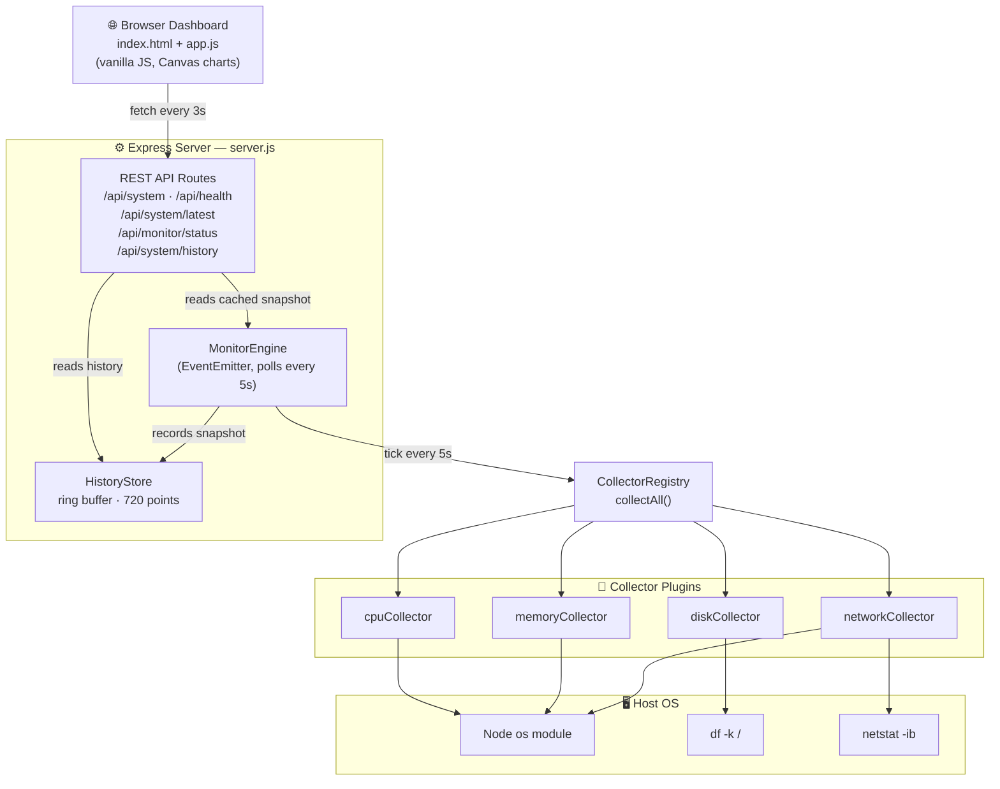
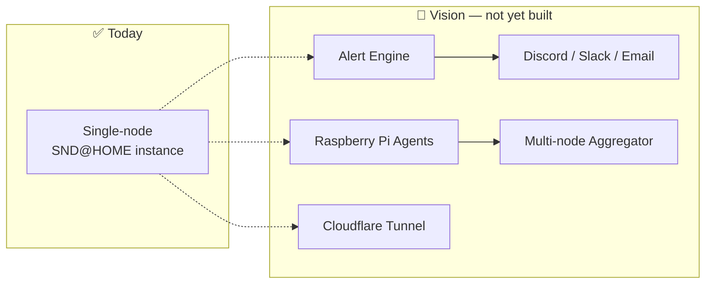

<div align="center">

# ⌂ SND@HOME

### AI-powered Home Infrastructure Monitoring Platform

**Turn your home server into a real, observable piece of infrastructure — no SaaS, no agents phoning home, no subscription.**

[](LICENSE)
[](https://nodejs.org)
[](https://developer.mozilla.org/en-US/docs/Web/JavaScript)
[](https://expressjs.com)
[](#contributing)
[](#contributing)

</div>

---

## Why SND@HOME?

Most home labs end up with the same story: a server quietly running in a closet, and no idea whether it's healthy until something breaks. Cloud monitoring SaaS is overkill for a single box, and most self-hosted dashboards are either bloated or dead projects.

**SND@HOME** starts from the opposite direction: a small, dependency-light Express server that polls your machine's vitals on a background loop, keeps a rolling history in memory, and serves it all through a clean REST API and a zero-framework live dashboard. No database. No external services. No build step. Clone it, `npm start`, and you have a live view of your box in your browser.

It's built as a **plugin-based collector architecture** from day one — new metrics are `register()`-ed into the engine without touching the polling loop, the API, or the dashboard. That's the foundation the roadmap below (alerting, notifications, multi-node monitoring) builds on.

---

## ✨ Features

### Current (implemented)

| Feature | Description |
|---|---|
| 🖥️ **System Monitoring** | Hostname, platform, load average, and uptime via Node's `os` module |
| 🔥 **CPU Monitoring** | Real usage % computed from two `os.cpus()` samples 100ms apart, plus core count |
| 🧠 **Memory Monitoring** | Used / total / percent from `os.totalmem()` / `os.freemem()` |
| 💾 **Disk Monitoring** | Used / total / percent parsed from `df -k /` |
| 🌐 **Network Monitoring** | Interfaces, local IP, and cumulative rx/tx bytes (via `netstat -ib`) |
| ⚙️ **Background Polling Engine** | Event-driven `MonitorEngine` polls all collectors every 5s and caches the latest snapshot in memory |
| 📜 **Historical Metrics** | Ring-buffer history store (720 points ≈ 1 hour at 5s intervals) for trend charts |
| 🔌 **REST API** | JSON endpoints for live snapshot, cached snapshot, history, and engine status |
| 📊 **Real-time Dashboard** | Dependency-free HTML/CSS/JS UI with live progress bars and Canvas-drawn trend charts, auto-refreshing every 3s |
| ❤️ **Health Check** | Simple `/api/health` endpoint for uptime checks / container orchestration |

### Upcoming (roadmap)

| Feature | Target Phase |
|---|---|
| 🚨 Alert Engine (threshold-based) | Phase 5 |
| 💬 Discord Notifications | Phase 5 |
| 💬 Slack Notifications | Phase 5 |
| 📧 Email Notifications | Phase 5 |
| 🔒 SSL Certificate Monitoring | Phase 5 |
| 🌍 DNS Monitoring | Phase 5 |
| 🐳 Docker Support | Phase 6 |
| ☁️ Cloudflare Tunnel Integration | Phase 6 |
| 🍓 Raspberry Pi Agent | Phase 6 |
| 🕸️ Multi-node Monitoring | Phase 6 |

> Nothing in this table exists in the code yet — see [Roadmap](#-roadmap) for where each item is headed.

---

## 🏗️ Architecture

### Current



The engine never blocks the API: routes always read from an in-memory cache, and a failed poll (e.g. `df` unavailable) just keeps the previous cached values instead of taking the server down.

### Where it's headed



---

## 🛠️ Tech Stack

- **Runtime:** [Node.js](https://nodejs.org) (>=18)
- **Server:** [Express](https://expressjs.com) 5.x
- **Language:** JavaScript (ES2022, CommonJS)
- **Frontend:** Vanilla HTML5 / CSS3 / JavaScript — no frontend framework, no build step, no bundler
- **Charts:** Hand-rolled Canvas 2D line charts (no chart.js / d3 / external libs)
- **API:** REST, JSON over HTTP
- **Data storage:** In-memory (no database) — CPU/disk/network metrics come from Node's `os` module plus the `df` and `netstat` system commands

> **Platform note:** the disk and network collectors shell out to `df -k /` and `netstat -ib`. This has been developed and tested on macOS; `df` is portable to Linux, but `netstat -ib` uses BSD-style flags — on Linux the network throughput fields (`rxBytes`/`txBytes`) may come back `null` depending on your `netstat`/`net-tools` version. Everything else works cross-platform.

---

## 📸 Screenshots

<div align="center">


*Live dashboard — CPU / Memory / Disk usage, host info, and trend charts.*

</div>

> 📌 Screenshot placeholder — drop a dashboard capture at `docs/dashboard.png` to replace this. Run the app locally (see [Usage](#-usage)) to see it live in the meantime.

---

## 🗺️ Roadmap

- [x] **Phase 1 — Foundation**: Express server bootstrap
- [x] **Phase 2 — Core System Monitoring**: CPU, memory, disk, and network collectors + `/api/system`, `/api/health`
- [x] **Phase 3 — Background Polling Architecture**: always-on `MonitorEngine`, in-memory cache, live dashboard UI
- [x] **Phase 4 — Historical Metrics & Visualization**: ring-buffer `HistoryStore`, `/api/system/history`, Canvas trend charts
- [ ] **Phase 5 — Alerting & Notifications** 🔄 *In Progress*
  - [ ] Threshold-based alert engine
  - [ ] Discord notifications
  - [ ] Slack notifications
  - [ ] Email notifications
  - [ ] SSL certificate monitoring
  - [ ] DNS monitoring
- [ ] **Phase 6 — Distributed & Self-Hosted Platform** 📋 *Planned*
  - [ ] Docker support
  - [ ] Cloudflare Tunnel integration
  - [ ] Raspberry Pi agent
  - [ ] Multi-node monitoring

---

## 🚀 Installation

**Requirements:** Node.js >= 18, npm, and a Unix-like OS (macOS or Linux — see the platform note in [Tech Stack](#️-tech-stack)).

```bash
# Clone the repository
git clone https://github.com/<your-username>/SND_HOME.git
cd SND_HOME

# Install dependencies
npm install

# Start the server
npm start
```

The server listens on port `3000` by default. Override it with the `PORT` environment variable:

```bash
PORT=4000 npm start
```

---

## 💻 Usage

Once the server is running, open your browser to:

```
http://localhost:3000
```

You'll see the live dashboard: CPU/memory/disk usage with progress bars, host info (hostname, IP, uptime), and four trend charts (CPU, memory, disk, network throughput) that redraw every 3 seconds from the polling history.

Prefer raw data? Hit the JSON API directly — see below.

```bash
curl http://localhost:3000/api/system | jq
```

Stop the server with `Ctrl+C` — it shuts down the background poller cleanly before exiting.

---

## 📡 API

All endpoints are served from the running Express app; only endpoints that exist in `server.js` are documented here.

| Method | Endpoint | Description |
|---|---|---|
| `GET` | `/` | Plain-text landing route (server up check) |
| `GET` | `/api/system` | Returns the latest cached system snapshot; runs a fresh collection if the cache is still empty (e.g. right after startup) |
| `GET` | `/api/system/latest` | Returns the cached snapshot only — `503` if the engine hasn't collected yet |
| `GET` | `/api/system/history?limit=N` | Returns up to `N` recent history points (default `120`) used for trend charts |
| `GET` | `/api/monitor/status` | Returns the polling engine's own status (running, interval, last update, uptime) |
| `GET` | `/api/health` | Simple liveness check — `{ "status": "ok" }` |

<details>
<summary><code>GET /api/system</code> — example response</summary>

```json
{
  "status": "ok",
  "hostname": "imac.local",
  "platform": "darwin",
  "cpu": { "usage": 12.4, "cores": 8 },
  "memory": { "used": 8589934592, "total": 17179869184, "percent": 50.0 },
  "disk": { "used": 214748364800, "total": 499963174912, "percent": 43.0 },
  "network": {
    "interfaces": [{ "name": "en0", "address": "192.168.1.42", "family": "IPv4", "internal": false }],
    "localIp": "192.168.1.42",
    "rxBytes": 1048576000,
    "txBytes": 524288000
  },
  "load": [1.23, 1.10, 0.98],
  "uptime": 349201,
  "timestamp": "2026-08-07T09:35:22.000Z"
}
```
</details>

<details>
<summary><code>GET /api/system/history?limit=2</code> — example response</summary>

```json
{
  "status": "ok",
  "count": 2,
  "interval": 5000,
  "data": [
    {
      "timestamp": "2026-08-07T09:35:12.000Z",
      "cpu": { "usage": 10.1 },
      "memory": { "percent": 49.8 },
      "disk": { "percent": 43.0 },
      "network": { "rxBytes": 1047500000, "txBytes": 523700000 }
    },
    {
      "timestamp": "2026-08-07T09:35:17.000Z",
      "cpu": { "usage": 12.4 },
      "memory": { "percent": 50.0 },
      "disk": { "percent": 43.0 },
      "network": { "rxBytes": 1048576000, "txBytes": 524288000 }
    }
  ]
}
```
</details>

<details>
<summary><code>GET /api/monitor/status</code> — example response</summary>

```json
{
  "running": true,
  "interval": 5000,
  "lastUpdated": "2026-08-07T09:35:22.000Z",
  "uptime": 612
}
```
</details>

---

## 📁 Project Structure

```
SND_HOME/
├── collectors/              # Metric collector plugins (name + collect())
│   ├── cpuCollector.js       # CPU usage % (sampled) + core count
│   ├── memoryCollector.js    # Used / total / percent memory
│   ├── diskCollector.js      # Used / total / percent disk (via df -k /)
│   └── networkCollector.js   # Interfaces, local IP, rx/tx bytes (via netstat -ib)
├── monitor/
│   ├── collectorRegistry.js  # Registers collectors, runs collectAll()
│   ├── monitorEngine.js      # EventEmitter-based background polling loop (5s)
│   └── historyStore.js       # In-memory ring buffer (720 points) for trend data
├── public/                   # Static dashboard, served by express.static
│   ├── index.html            # Dashboard markup
│   ├── app.js                # Fetch loop, rendering, Canvas line charts
│   └── style.css             # Dark, GitHub-inspired theme
├── server.js                 # Express app, routes, startup/shutdown
├── package.json
└── package-lock.json
```

---

## 🔭 Future Vision

SND@HOME's long-term goal is to become a genuinely **AI-powered, self-hosted infrastructure monitoring platform** — not another dashboard you have to babysit.

The collector-plugin and event-driven engine design already in place (`collectorRegistry.register()`, `MonitorEngine`'s `update`/`error` events) exists specifically so the next layers can be added *without* rewriting the core:

- **Self-hosted first** — your metrics, your box, no third-party cloud dependency.
- **Alerting as a subscriber** — the engine already emits `update`/`error` events; an alert engine is a listener away, not a rewrite.
- **AI-assisted insight** — once history accumulates, anomaly detection and natural-language health summaries ("your disk usage has been trending up 3%/day") become possible on top of the existing `HistoryStore`, without changing how metrics are collected.
- **Beyond one box** — Raspberry Pi agents and multi-node aggregation extend the same collector/engine model across a whole home network.

None of this exists yet — it's the direction the architecture is deliberately built to support. See [Roadmap](#️-roadmap) for the concrete, incremental path there.

---

## 🤝 Contributing

Contributions are very welcome — this project is still early, and there's a lot of surface area to help with.

1. **Fork** the repository and create a branch off `main`: `git checkout -b feat/your-feature`
2. **Keep collectors self-contained** — a new metric should be a new file in `collectors/` exporting `{ name, collect() }` and registered in `collectorRegistry.js`. Avoid touching `monitorEngine.js` unless you're changing the polling model itself.
3. **Match the existing style** — CommonJS modules, small focused functions, comments only where the *why* isn't obvious from the code.
4. **Test manually** — there's no automated test suite yet (`npm test` is a stub), so please describe how you verified your change in the PR description. Adding real tests is itself a great first contribution.
5. **Open a PR** against `main` with a clear description of what changed and why.

Found a bug or have an idea? Open an issue — even rough ones are useful.

---

## 📄 License

Distributed under the **MIT License**. See [`LICENSE`](LICENSE) for the full text.

---

<div align="center">

Built for home labs that deserve better than a blinking cursor and a prayer.

**⌂ SND@HOME**

</div>
